<h1>1. Acquisition de données</h1>
Nous allons regarder comment télécharger les données play-by-play de la NHL depuis [https://statsapi.web.nhl.com](https://statsapi.web.nhl.com).


Les données des parties sont enregistrées sous un format json et sont accessibles à https://statsapi.web.nhl.com/api/v1/game/[GAME_ID]/feed/live/.

Pour accèder aux données d'une partie précise il faut simplement remplacer GAME_ID par l'identifiant de la partie. 

Vous pouvez allez jeter un coup d'oeil au fichier json de la partie d'ouverture de la saison 2018: [https://statsapi.web.nhl.com/api/v1/game/2018020001/feed/live/](https://statsapi.web.nhl.com/api/v1/game/2018020001/feed/live/).

<h2>Comment télécharger ce json?</h2>

Il est très facile de télécharger un fichier json à partir d'un URL avec la librairie Requests.

```python
import requests

game_id = 2018020001

url = f'https://statsapi.web.nhl.com/api/v1/game/{game_id}/feed/live/'

response = requests.get(url)
        
json = response.json

```
Utilisons ce code pour créer une fonction qui retourne le fichier json d'une partie. Cette fonction télécharge le fichier et le sauvegarde dans 'out_dir'. Si le fichier est déjà téléchargé, elle le retourne tout simplement.
```python
import requests
import os
import json

def get_game(id: int,out_dir:str) -> json:
       
    path = os.path.join(out_dir, id + '.json')
        
    if os.path.exists(path):
        with open(path) as f:
            return json.load(f)

    url = f'https://statsapi.web.nhl.com/api/v1/game/{id}/feed/live/'

    response = requests.get(url)
        
    with open(path,'+w') as f:
        f.write(response.text)

    return response.json
```
<h2>Comment télécharger une saison régulière?</h2>
Avec get_game() on peut télécharger une partie et la sauvegarder. Maintenant, essayons de télécharger l'ensemble des parties d'une saison régulière.

Premièrement, regardons comment l'id d'une partie est composée. En prenant pour exemple: 2018020001.

<center> <b>2018 02 0001</b> </center>


Les 4 premiers chiffres (<b>2018</b>) représentent la saison, ici la saison 2018-2019.

Les 2 chiffres suivant (<b>02</b>) représentent le type de partie, ici 02 représente les parties de la saison régulière.

Les 4 derniers chiffres (<b>0001</b>) représentent le numéro de la partie, ici il s'agit de la première partie donc 0001.


Dans une saison régulière, on compte normalement 1230 parties et 1271 parties à partir de la saison 2017-2018 ( 31 équipes au lieu de 30).
La saison 2020-2021 fait exception due à la pandémie de covid-19, cette saison ne comptait que 868 parties.
 
Avec ces informations on peut écrire une fonction qui télécharge l'ensemble des parties d'une saison donnée.

```python

def get_regular_season(year:int, out_dir:str) -> dict:

        number_of_games = 1230

        if year >= 2017:
            number_of_games = 1271 
   
        if year == 2020:
            number_of_games = 868 # less games due to Covid

        d = dict()

        for game_number in range( 1 , number_of_games + 1 ):

            game_id = f'{year}02{game_number:04}'
            d[game_id] = get_game(game_id, out_dir)

        return d  

```
<h2>Comment télécharger les finales?</h2>   
On peut faire quelque chose de similaire pour télécharger l'ensemble des données pour des finales.

Les ids des finales sont composées différemment. Regardons par exemple le premier match des finales de la saison 2018-2019: 2018030111.

<center> <b>2018 03 0 111</b> </center>

Les 4 premiers chiffres (2018) représentent la saison, ici la saison 2018-2019.
 
Les 2 chiffres suivants (03) représentent le type de partie, ici 03 représentent les parties finales.
 
Le 0 est toujours là et ne représente rien.
 
Les 3 derniers chiffres (111) représentent le numéro de la partie, ici le premier chiffre représente le round, le deuxième le match up et le troisième le numéro de la partie.


```python

def get_playoffs(year:int, out_dir:str) -> dict:
        
        d = dict()

	# Round 1 has 8 matchups, Round 2 has 4 matchups,...
        nb_of_matchups_per_round = [8,4,2,1] 

	# There are 4 rounds 
        for round in range(1,5): 

	  # Iterate through each matchup
          for matchup in range(1,nb_of_matchups_per_round[round-1]+1):
 
		# There are 7 games per matchup
                for match in range(1,8): 

                    game_id = f'{year}030{round}{matchup}{match}'
                    d[game_id] = self.get_game(game_id, out_dir)

        return d

```

<h2>Tout ensemble</h2>
Le tout peut être réécrit sous forme d'une classe plus facile à utiliser.

```python
import requests
import os
import json

class NHL_Season_Data_Fetcher:

    def __init__(self,seasons:list,out_dir:str) -> None:
        '''
        Initialize the object and create the base directory.
        self.seasons -> list of int for the years ex:[2017,2018,2019]
        self.base_dir -> the directory where the jsons are saved.
        '''
        self.seasons = seasons
        self.base_dir = out_dir
        create_dir(self.base_dir)

    def get_seasons(self) -> dict:
        '''
        Function that retrieves all seasons and returns a dictionary.
        It returns a dictionary with a key for each year.
        Key structure:
        Year -> 'regular season' or 'playoffs' -> GAME ID -> JSON
        '''
        d = dict()
        for year in self.seasons:
            d[year] = self.get_season(year)
        return d

    def create_season_dirs(self, year:int) -> str:
        '''
        Creates the season's directories
        '''
        
        dir_year = os.path.join(self.base_dir,str(year))
        create_dir(dir_year)
        
        dir_regular_season = os.path.join(dir_year,'regular_season')
        create_dir(dir_regular_season)

        dir_playoffs = os.path.join(dir_year,'playoffs')
        create_dir(dir_playoffs)

        return dir_regular_season, dir_playoffs

    def get_season(self,year:int)->dict:
        '''
        Function that retrieves all data for a season.
        returns a dict with two keys ['regular season','playoffs']
        '''

        assert(len(str(year))==4)

        dir_reg_season, dir_playoffs = self.create_season_dirs(year)

        #Fecth Data
        d = dict()
        d['regular season'] = self.get_reg_season(year,dir_reg_season)
        d['playoffs'] = self.get_playoffs(year,dir_playoffs)

        return d


    def get_reg_season(self,year:int, out_dir:str) -> dict:
        '''
        Function that retrieves all regular season game of a season.
        returns a dict whose keys are the Game ID of each game.
        '''

        number_of_games = 1230
        if year >= 2017:
            number_of_games = 1271    
        if year == 2020:
            number_of_games = 868 # less games due to Covid

        d = dict()
        for game_number in range( 1 , number_of_games + 1 ):
            game_id = f'{year}02{game_number:04}'
            d[game_id] = self.get_game(game_id, out_dir)

        return d  


    def get_playoffs(self,year:int, out_dir:str) -> dict:
        '''
        Function that retrieves all playoffs of a season.
        returns a dict whose keys are the Game ID of each game.
        '''
        d = dict()

	# Round 1 has 8 matchups, Round 2 has 4 matchups, etc.
        nb_of_matchups_per_round = [8,4,2,1] 

	# There are 4 rounds 
        for round in range(1,5): 

	  # Iterate through each matchup
          for matchup in range(1,nb_of_matchups_per_round[round-1]+1): 

	     # There are 7 games per matchup
             for match in range(1,8): 

                 game_id = f'{year}030{round}{matchup}{match}'
                 d[game_id] = self.get_game(game_id, out_dir)

        return d

    def get_game(self,id: int,out_dir:str) -> json:
     '''
     Function that retrieves the json of a particular Game ID at
     https://statsapi.web.nhl.com/api/v1/game/[GAME_ID]/feed/live/
     It returns a json object.
     '''
     path = os.path.join(out_dir, id + '.json')
        
     if os.path.exists(path):
         with open(path) as f:
             return json.load(f)

     url = f'https://statsapi.web.nhl.com/api/v1/game/{id}/feed/live/'

     response = requests.get(url)
        
     with open(path,'+w') as f:
         f.write(response.text)

     return response.json


def create_dir(dir_name:str) -> None:
    '''
    create a directory if it doesn't exist
    '''
    if not os.path.exists(dir_name):
        os.mkdir(dir_name)

```
Pour l'utiliser on peut faire comme ceci:
```python

if __name__ == '__main__':

    path_out = 'datasets'
    years = [2016,2017,2018,2019,2020]

    fetcher = NHL_Season_Data_Fetcher(years,path_out)
    d = fetcher.get_seasons()

```

<h1>2. Outil de débogage interactif</h1>
Voici une visualisation de l'outil:
<br/>
<br/>
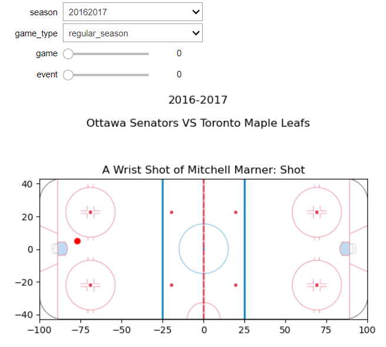
<br/>
Notre outil intéractif permet de montrer la position de tous les tirs de la LNH pour les saisons 2016-2017 à 2020-2021. Pour chaque tir, le nom du joueur et le type de tir sont affichés. On peut aussi voir quelles équipes s'affrontent.
<br/>
<br/>
Voici le code pour initialiser les valeurs de l'outil:
```python
df = pd.read_csv(path_tidy)
#SET DEFAULT VALUES
season =  20162017
seasonW = Dropdown(options = df['season'].unique(), value = season)

game_type = 'regular_season'
game_typeW = Dropdown(options=['playoffs','regular_season'], value = game_type)
 
games = df[(df['season']==season) & (df['type_season']==game_type)]['id_game'].unique()
gameW = IntSlider(value = 0,min=0,max=len(games)-1,continuous_update=False)


events = df[(df['season']==season) & (df['type_season']==game_type) & (df['id_game']==games[0])]
eventW = IntSlider(value = 0,min=0,max=len(events)-1,continuous_update=False)
```
Et voici le code pour que l'outil soit intéractif:
```python
#INTERACTIF DEBUGGER
@interact(season = seasonW,game_type = game_typeW,game = gameW,event=eventW)
def debugger(season,game_type,game,event):
    
    #RESET GAMES
    games = df[(df['season']==season) & (df['type_season']==game_type)]['id_game'].unique()
    gameW.max = len(games) - 1
    
    if game > len(games):
        game = 0
        gameW.value = 0
        
    #RESET EVENTS
    events = df[(df['season']==season) & (df['type_season']==game_type) & (df['id_game']==games[game])]
    eventW.max =  len(events) - 1
    
    if event >  len(events):
        event = 0
        eventW.value = 0
        
    #GET INFO FOR THIS PARTICULAR EVENT
    event_infos = events.iloc[event]
    
    #PLOT BACKGROUND IMAGE
    fig, ax = plt.subplots()
    img = plt.imread("../figures/nhl_rink.png")
    ax.imshow(img, extent=[-100, 100, -43, 43])
    
    #SUPTITLE
    season_title = f'{str(season)[:4]}-{str(season)[4:]}'
    home = event_infos['team_home_name']
    away = event_infos['team_away_name']
   
    plt.suptitle(f'{season_title}\n\n{home} VS {away}')
    
    #TITLE
    shot_type =  event_infos['shot_type']
    event_type =  event_infos['result_event']
    player =  event_infos['shooter_name']
     
    plt.title(f'A {shot_type} of {player}: {event_type}')
   
   
    #PLOT POINT AT THE LOCATION OF THE EVENT
    x =  event_infos['x_coord']
    y =  event_infos['y_coord']
    ax.scatter(x, y, marker='o', color='r', label='point')
    
    #REMOVE PAST PLOTS IF ANY
    clear_output(wait=True)
```

<h1>4. Rangez les données</h1>

<h2>4.1 Interpréations </h2>

Voici les données que nous avons extrait (.head(10)). Nous en avons extrait plus que nécessaires au cas où, plus tard, dans le projet on en aurait besoin.


<h2>4.2 </h2>
Discutez de la façon dont vous pourriez ajouter les informations sur la force réelle (c'est-à-dire 5 contre 4, etc.) aux tirs et aux buts, compte tenu des autres types d'événements (au-delà des tirs et des buts) et des fonctionnalités disponibles. Vous n'avez pas besoin de l'implémenter pour ce jalon. 

***Reponse :***
Pour tous les évènements on a des informations sur les joueurs qui sont impliqués dans l'action dans l'attribut "players". En particulier on connait leurs ID. On pourrait identifier l'équipe de chaque joueur à partir de leur ID, en regardant dans gameData->players-> < IDdu joueur > -> currentTeam. Puis, compter le nombre de joueurs appartenant à chaque team pour connaitre le rapport de force réel.

<h2>4.3 </h2>
Discutez d’au moins 3 fonctionnalités supplémentaires que vous pourriez envisager de créer à partir des données disponibles dans cet ensemble de données. Nous ne cherchons pas de réponses particulières, mais si vous avez besoin d'inspiration, un tir ou un but pourrait-il être classé comme un rebond/tir dans le rush (expliquez comment déterminer ceux-ci)?

***Reponse :***
On pourrait chercher les informations pour savoir :

1. Est-ce que un tir a été assisté ou pas. Pour cela on regarde dans : liveData-> plays-> allPlays-> {numéro du play} -> players puis on regarde s’il y a des joueurs un avec le type playerType="Assist".

2. Est-ce que le goal est un point décisif (ie est ce que c'est un but qui a departagé les 2 équipes d'une égalité). liveData-> plays-> allPlays-> {numéro du play} -> about -> goals. Si c'est un "Shot" et qu’il y a égalité ou c'est un Goal et il y a 1 point d'écart en faveur de l'équipe qui a tiré, alors c'est un point décisif.

3. Est-ce que le "Gaol"/le but fait est un "golden goal" ? C'est à dire, est-ce que c'est un but qui a marqué la fin du match.Pour cela, on regarde la période (qu'on a déjà extrait dans notre dataframe, si cette période est supérieur à 4, et que l'équipe marque, alors c'est un "golden goal".


<h1>6. Visualisations avancées</h1>

<h2>6.1 Les graphiques</h2>
Saison:
<select name="Seasons" id="faq-seasons" onchange="myfunc(this.value)">
    <option value="1">2016-2017</option>
    <option value="2">2017-2018</option>
    <option value="3">2018-2019</option>
    <option value="4">2019-2020</option>
    <option value="5">2020-2021</option>
</select>

<div class="answer" id="season1">
    
</div>
<div class="answer" id="season2" hidden>
    
</div>
<div class="answer" id="season3" hidden>
    
</div>
<div class="answer" id="season4" hidden>
    
</div>
<div class="answer" id="season5" hidden>
    
</div>
<script  type="text/javascript">
    console.log("text/javascript")
    function myfunc(value){
        var innerDivs = document.getElementsByClassName('answer');
        for(var i = 0; i < innerDivs.length; i++){
            innerDivs[i].style.display = 'none';
        }
        document.getElementById('season'+value).style.display = 'block';
    }
   
</script>


<h2>6.2 Interprétations </h2>
Les shotmaps permettent d'indiquer, pour chaque saison, les espaces que chaque équipe a le plus exploité en moyenne par match lors de tirs et coups sur le côté offensif :

- Les régions où les équipes génèrent plus de tirs que la moyenne de la ligue sont en rouges
- Les régions où les équipes génèrent moins de tirs que la moyenne de la ligue sont en bleues
- Les régions où les équipes génèrent autant de tirs que la moyenne de la ligue sont en blancs

De ces graphiques on peut donc y lire et analyser les stratégies des différentes équipes. On peut savoir, est-ce qu'une équipe a plus tendance à tirer depuis la droite du filet ou de la gauche. Est-ce qu'ils tirent très proche du filet où est-ce qu'ils profitent des ouvertures en tirant de loin. Ce sont des éléments importants car en tant qu'équipe adverse, on pourrait alors apprendre à contrer ce genre de tactiques. C'est également utile pour les équipes en elle même, car elles pourraient analyser leur jeux et comprendre leur points faibles et leurs points forts.

<h2>6.3 Analyse 1 </h2>
<h3>Progression de l'Avalanche du Colorado</h3>

<table>
    <tr>
        <td>
            <center>2016-2017</center>       
        </td>
        <td></td>
        <td>
           <center> 2020-2021</center>
        </td>
        <td></td>
    </tr>
    <tr>
        <td>
            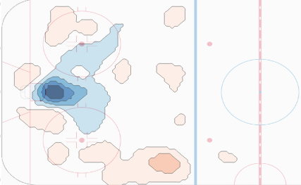
        </td>
        <td>
            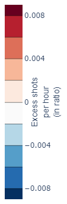
        </td>
        <td>
            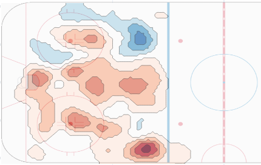
        </td>
        <td>
            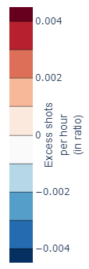
        </td>
    </tr>
</table>

En 2016 on remarque que l’équipe ne se démarque peu. La carte est plutôt blanche, et il y a beaucoup de bleu proche du filet adverse indiquant qu’ils n’ont pas eu souvent l’opportunité de s’en approcher. 

En 2020 on constate beaucoup plus de points rouge foncé montrant que l’équipe effectue en moyenne plus de tirs que les autres équipes. Ils semblent être beaucoup plus agressifs et sont capables de se rapprocher très près du but adverse.

Les observations font du sens puisqu’en 2016 l’Avalanche du Colorado a joué la pire saison de la LNH de tous les temps. Et qu’en 2020 l’Avalanche s’est rendue en finale avec de très bons résultats.

<h2>6.4 Analyse 2 </h2>
<h3>Comparaison: les Sabres de Buffalo et les Lightning de Tampa Bay</h3>
<center>La saison 2018-2019</center>   
<table>
    <tr>
        <td>
            <center>Sabres de Buffalo</center>       
        </td>
        <td></td>
        <td>
           <center>Lightning de Tampa Bay</center>
        </td>
        <td></td>
    </tr>
    <tr>
        <td>
            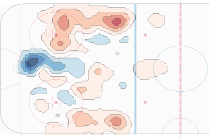
        </td>
        <td>
            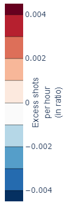
        </td>
        <td>
            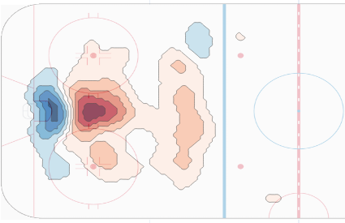
        </td>
        <td>
            
        </td>
    </tr>
</table>

On observe que le jeu des Lightning est très concentré, proche du filet et central comparé au jeu des Sabres qui est éparse et près des bandes. Le jeu des Lightning semble très certain et agressif, celui des Buffalos semble hésitant et inconstant.

<center>La saison 2019-2020</center>   
<table>
    <tr>
        <td>
            <center>Sabres de Buffalo</center>       
        </td>
        <td></td>
        <td>
           <center>Lightning de Tampa Bay</center>
        </td>
        <td></td>
    </tr>
    <tr>
        <td>
            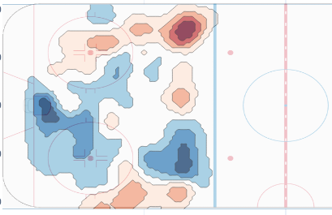
        </td>
        <td>
            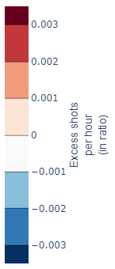
        </td>
        <td>
            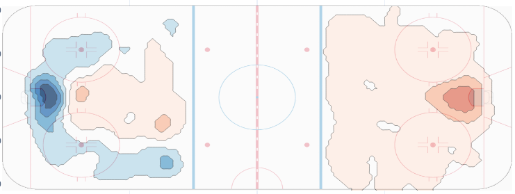
        </td>
        <td>
            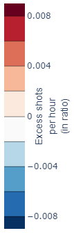
        </td>
    </tr>
</table>
Nous avons mis l'image entière ici pour les Lightning puisque l'API semble contenir de drôle de données pour l'année 2019. En effet, plusieurs équipes dans cette saison semblent avoir des tirs attribués au mauvais côté de la patinoire.
 
Vu que les Lightning étaient très forts cette année-là, il serait étonnant que la zone offensive soit autant bleu.
 
Si l'on considère une erreur de l'API, on peut pivoter les tirs de droite sur la gauche et s'imaginer un portrait très différent. On verrait alors une image beaucoup plus similaire à celle de la saison 2018-2019.
 
Les Sabres semblent encore plus en difficulté cette année-là, ils tirent de très loin et peine à se rapprocher du filet adverse.


<center>La saison 2020-2021</center>   
<table>
    <tr>
        <td>
            <center>Sabres de Buffalo</center>       
        </td>
        <td></td>
        <td>
           <center>Lightning de Tampa Bay</center>
        </td>
        <td></td>
    </tr>
    <tr>
        <td>
            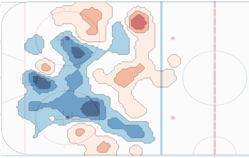
        </td>
        <td>
            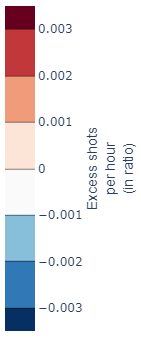
        </td>
        <td>
            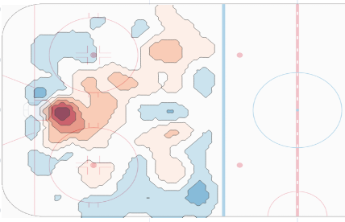
        </td>
        <td>
            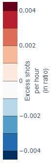
        </td>
    </tr>
</table>

Encore une fois les Lightning réussissent à se frayer un chemin vers le filet adverse bien que moins prononcé qu'en 2018. Les Sabres ont encore un jeu faible, très bleu proche du filet adverse. Ils tirent encore de très loin et depuis les bandes.

Cependant, l'image ne nous donne pas un portrait complet, il n'est pas si clair que de jouer comme la moyenne ou sous la moyenne dans certaines régions de la patinoire soit réellement un désavantage.
Ce ne sont que les tirs, pas leur taux de réussite. La performance du gardien, qui est extrêmement importante, n'est pas du tout prise en compte. On ne visualise aussi aucune information sur la qualité de la défense. C’est un outil très intéressant pour analyser le côté offensif des équipes, mais ce n'est pas suffisant pour juger de la performance d’une équipe dans son ensemble.


