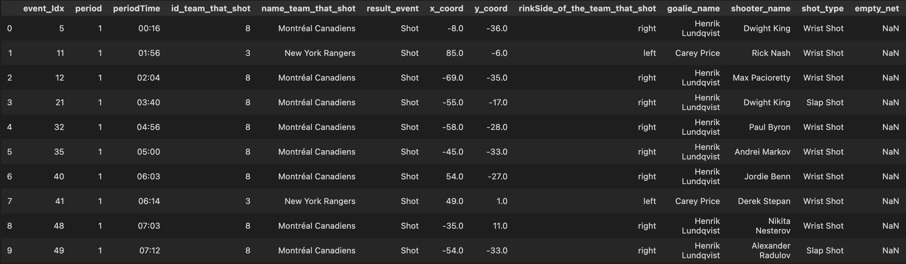

<h1>1. Acquisition de données</h1>
Nous allons regarder comment télécharger les données play-by-play de la NHL depuis [https://statsapi.web.nhl.com](https://statsapi.web.nhl.com).


Les données pour chacune des parties sont stockées sous un format json et sont accessibles à https://statsapi.web.nhl.com/api/v1/game/[GAME_ID]/feed/live/.

Pour accèder aux données d'une partie précise il faut simplement remplacer GAME_ID par l'identifiant de la partie. 

Vous pouvez allez jeter un coup d'oeil au fichier json de la partie d'ouverture de la saison 2018: [https://statsapi.web.nhl.com/api/v1/game/2018020001/feed/live/](https://statsapi.web.nhl.com/api/v1/game/2018020001/feed/live/).

<h2>Comment télécharger ce json?</h2>

Il est très facile de télécharger un fichier json à partir d'un URL avec la librairie Requests.

```python
import requests

game_id = 2018020001

url = f'https://statsapi.web.nhl.com/api/v1/game/{game_id}/feed/live/'

response = requests.get(url)
        
json = response.json

```
Utilisons ce code pour créer une fonction qui retourne le fichier json d'une partie. Cette fonction téléchargera le fichier et le sauvegardera dans 'out_dir'. Si le fichier est déjà téléchargé elle le retournera tout simplement.
```python
import requests
import os
import json

def get_game(id: int,out_dir:str) -> json:
       
    path = os.path.join(out_dir, id + '.json')
        
    if os.path.exists(path):
        with open(path) as f:
            return json.load(f)

    url = f'https://statsapi.web.nhl.com/api/v1/game/{id}/feed/live/'

    response = requests.get(url)
        
    with open(path,'+w') as f:
        f.write(response.text)

    return response.json
```
<h2>Comment télécharger une saison régulière?</h2>
Avec get_game() on peut télécharger une partie et la sauvegarder. Maintenant, essayons de télécharger l'ensemble des parties d'une saison régulière.

Premièrement, regardons comment l'id d'une partie est composée. En prenant pour exemple: 2018020001.

<center> <b>2018 02 0001</b> </center>


Les 4 premiers chiffres (<b>2018</b>) représente la saison, ici la saison 2018-2019.

Les 2 chiffres suivant (<b>02</b>) représentent le type de partie, ici 02 représente les parties de la saison régulière.

Les 4 derniers chiffres (<b>0001</b>) représentent le numéro de la partie, ici il s'agit de la première partie donc 0001.


Dans une saison régulière on compte normalement 1230 parties et 1271 parties à partir de la saison 2017-2018 ( 31 équipes au lieu de 30).
La saison 2020-2021 fait exception due à la pandémie de covid-19, cette saison ne comptait que 868 parties.

Avec ces informations on peut écrire une fonction qui télécharge l'ensemble des parties d'une saison donnée.
```python

def get_regular_season(year:int, out_dir:str) -> dict:

        number_of_games = 1230

        if year >= 2017:
            number_of_games = 1271 
   
        if year == 2020:
            number_of_games = 868 # less games due to Covid

        d = dict()

        for game_number in range( 1 , number_of_games + 1 ):

            game_id = f'{year}02{game_number:04}'
            d[game_id] = get_game(game_id, out_dir)

        return d  

```
<h2>Comment télécharger les finales?</h2>   
On peut faire quelque chose de similaire pour télécharger l'ensemble des données pour des finales.

Les ids des finales sont composées différemment. Regardons par exemple le premier match des finales de la saison 2018-2019: 2018030111.

<center> <b>2018 03 0 111</b> </center>

Les 4 premiers chiffres (2018) représente la saison, ici la saison 2018-2019.

Les 2 chiffres suivant (03) représentent le type de partie, ici 03 représente les parties des finales.

Le 0 est toujours là et ne représente rien.

Les 3 derniers chiffres (111) représentent le numéro de la partie, ici le premier chiffre représente le round, le deuxième le matchup et le troisième le numéro de la partie.

```python

def get_playoffs(year:int, out_dir:str) -> dict:
        
        d = dict()

	# Round 1 has 8 matchups, Round 2 has 4 matchups,...
        nb_of_matchups_per_round = [8,4,2,1] 

	# There are 4 rounds 
        for round in range(1,5): 

	  # Iterate through each matchup
          for matchup in range(1,nb_of_matchups_per_round[round-1]+1):
 
		# There are 7 games per matchup
                for match in range(1,8): 

                    game_id = f'{year}030{round}{matchup}{match}'
                    d[game_id] = self.get_game(game_id, out_dir)

        return d

```

<h2>Tout ensemble</h2>
Le tout peut être réécris sous forme d'une classe plus facile à utiliser.

```python
import requests
import os
import json

class NHL_Season_Data_Fetcher:

    def __init__(self,seasons:list,out_dir:str) -> None:
        '''
        Initialize the object and create the base directory.
        self.seasons -> list of int for the years ex:[2017,2018,2019]
        self.base_dir -> the directory where the jsons are saved.
        '''
        self.seasons = seasons
        self.base_dir = out_dir
        create_dir(self.base_dir)

    def get_seasons(self) -> dict:
        '''
        Function that retrieves all seasons and returns a dictionary.
        It returns a dictionary with a key for each year.
        Key structure:
        Year -> 'regular season' or 'playoffs' -> GAME ID -> JSON
        '''
        d = dict()
        for year in self.seasons:
            d[year] = self.get_season(year)
        return d

    def create_season_dirs(self, year:int) -> str:
        '''
        Creates the season's directories
        '''
        
        dir_year = os.path.join(self.base_dir,str(year))
        create_dir(dir_year)
        
        dir_regular_season = os.path.join(dir_year,'regular_season')
        create_dir(dir_regular_season)

        dir_playoffs = os.path.join(dir_year,'playoffs')
        create_dir(dir_playoffs)

        return dir_regular_season, dir_playoffs

    def get_season(self,year:int)->dict:
        '''
        Function that retrieves all data for a season.
        returns a dict with two keys ['regular season','playoffs']
        '''

        assert(len(str(year))==4)

        dir_reg_season, dir_playoffs = self.create_season_dirs(year)

        #Fecth Data
        d = dict()
        d['regular season'] = self.get_reg_season(year,dir_reg_season)
        d['playoffs'] = self.get_playoffs(year,dir_playoffs)

        return d


    def get_reg_season(self,year:int, out_dir:str) -> dict:
        '''
        Function that retrieves all regular season game of a season.
        returns a dict whose keys are the Game ID of each game.
        '''

        number_of_games = 1230
        if year >= 2017:
            number_of_games = 1271    
        if year == 2020:
            number_of_games = 868 # less games due to Covid

        d = dict()
        for game_number in range( 1 , number_of_games + 1 ):
            game_id = f'{year}02{game_number:04}'
            d[game_id] = self.get_game(game_id, out_dir)

        return d  


    def get_playoffs(self,year:int, out_dir:str) -> dict:
        '''
        Function that retrieves all playoffs of a season.
        returns a dict whose keys are the Game ID of each game.
        '''
        d = dict()

	# Round 1 has 8 matchups, Round 2 has 4 matchups, etc.
        nb_of_matchups_per_round = [8,4,2,1] 

	# There are 4 rounds 
        for round in range(1,5): 

	  # Iterate through each matchup
          for matchup in range(1,nb_of_matchups_per_round[round-1]+1): 

	     # There are 7 games per matchup
             for match in range(1,8): 

                 game_id = f'{year}030{round}{matchup}{match}'
                 d[game_id] = self.get_game(game_id, out_dir)

        return d

    def get_game(self,id: int,out_dir:str) -> json:
     '''
     Function that retrieves the json of a particular Game ID at
     https://statsapi.web.nhl.com/api/v1/game/[GAME_ID]/feed/live/
     It returns a json object.
     '''
     path = os.path.join(out_dir, id + '.json')
        
     if os.path.exists(path):
         with open(path) as f:
             return json.load(f)

     url = f'https://statsapi.web.nhl.com/api/v1/game/{id}/feed/live/'

     response = requests.get(url)
        
     with open(path,'+w') as f:
         f.write(response.text)

     return response.json


def create_dir(dir_name:str) -> None:
    '''
    create a directory if it doesn't exist
    '''
    if not os.path.exists(dir_name):
        os.mkdir(dir_name)

```
Pour l'utiliser on peut faire comme ceci:
```python

if __name__ == '__main__':

    path_out = 'datasets'
    years = [2016,2017,2018,2019,2020]

    fetcher = NHL_Season_Data_Fetcher(years,path_out)
    d = fetcher.get_seasons()

```

<h1>4. Rangez les données</h1>

<h2>4.1 Interpréations </h2>

Voici les données que nous avons extrait (.head(10)). Nous en avons extrait plus que nécessaires au cas où plus tard dans le projet on en aurait besoin.




<h2>4.2 </h2>
Discutez de la façon dont vous pourriez ajouter les informations sur la force réelle (c'est-à-dire 5 contre 4, etc.) aux tirs et aux buts, compte tenu des autres types d'événements (au-delà des tirs et des buts) et des fonctionnalités disponibles. Vous n'avez pas besoin de l'implémenter pour ce jalon. 

Reponse : 

<h2>4.3 </h2>
Discutez d’au moins 3 fonctionnalités supplémentaires que vous pourriez envisager de créer à partir des données disponibles dans cet ensemble de données. Nous ne cherchons pas de réponses particulières, mais si vous avez besoin d'inspiration, un tir ou un but pourrait-il être classé comme un rebond/tir dans le rush (expliquez comment déterminer entre ceux-ci?

Reponse : 

<h1>6. Visualisations avancées</h1>

<h2>6.1 le graphiques</h2>






<h2>6.2 Interpréations </h2>

<h2>6.3 Interpréations </h2>

<h2>6.4 Interpréations </h2>