<h1>4. Ingénierie des caractéristiques II </h1>

<table>
  <tr>
    <th>Caractéristique</th>
    <th>Nom de la colonne</th>
    <th>Description</th>
  </tr>
  <tr>
    <td>Coordonnées</td>
    <td>x_coord et y_coord</td>
    <td>Coordonnées de l'événement</td>
  </tr>
  <tr>
    <td>Distance</td>
    <td>distance</td>
    <td>Distance entre le joueur et le but adverse</td>
  </tr>
  <tr>
    <td>Angle</td>
    <td>angle</td>
    <td>Angle entre le joueur et le but</td>
  </tr>
  <tr>
    <td>Type de tir</td>
    <td>shot_type</td>
    <td>Type du tir effectué (ex: Slap Shot)</td>
  </tr>
  <tr>
    <td>Filet désert</td>
    <td>empty_net</td>
    <td>Vrai si le filet est désert</td>
  </tr>
  <tr>
    <td>Dernier événement</td>
    <td>last_event_type</td>
    <td>Type du dernier événement (ex: Faceoff)</td>
  </tr>
  <tr>
    <td>Coordonnées du dernier événement</td>
    <td>last_x_coord et last_y_coord </td>
    <td>Coordonnées du dernier événement</td>
  </tr>
  <tr>
    <td>Distance avec le dernier événement</td>
    <td>distance_from_last</td>
    <td>Distance entre le tir et le dernier événement</td>
  </tr>
  <tr>
    <td>Temps depuis le dernier événement</td>
    <td>seconds_since_last</td>
    <td>Temps entre le tir et le dernier événement</td>
  </tr>
  <tr>
    <td>Rebon</td>
    <td>Rebound</td>
    <td>Vrai si le dernier événement était un tir</td>
  </tr>
  <tr>
    <td>Changement d'angle</td>
    <td>angle_change</td>
    <td>Différence d'angle entre ce tir et le tir précédent</td>
  </tr>
  <tr>
    <td>Vitesse</td>
    <td>speed</td>
    <td>Vitesse entre les deux événements</td>
  </tr>
  <tr>
    <td>Supériorité numérique</td>
    <td>powerplay</td>
    <td>Vrai, si l'équipe attaquante à plus de joueur sur la glace</td>
  </tr>
  <tr>
    <td>Nombre de joueur de l'équipe attaquante</td>
    <td>team_that_shot_nb</td>
    <td>Nombre de joueur de l'équipe attaquante</td>
  </tr>
  <tr>
    <td>Nombre de joueur de l'équipe défendante</td>
    <td>other_team_nb</td>
    <td>Nombre de joueur de l'équipe défendante</td>
  </tr>
</table>
### 4.4 Bonus: supériorité numérique
Nous avons ajouté trois caractéristiques supplémentaires pour la supériorité numérique; une caractéristique booléenne si l'équipe qui tire est en supériorité numérique et le nombre joueur dans chaque équipe pour chaque tir.

Quelques détails concernant notre implémentation:

- Nos pénalités sont calculées de sorte qu' elles soient transférables d'une période à une autre. 

- Une troisième pénalité qui ferait en sorte que moins de trois joueurs soient sur la glace est simplement ignorée. 

- Les pénalités 'Misconduct' sont elles aussi ignorées car elles n'affectent pas le nombre de joueurs sur la glace. 

- Lorsqu'un but est marqué par une équipe en supériorité numérique, la pénalité mineure ayant le moins de temps restant de l’autre équipe est annulée. 

- Similairement au point précédent, si un joueur possède plusieurs pénalités dont une mineure, deux minutes seront retranchées à son temps total. 

<h1>6. Faites de votre mieux! </h1>
### Réseaux neuronaux entrainés avec toutes les caractéristiques sauf les PowerPlay
Pour entraîner les réseaux neuronaux nous avons utilisé une architecture de Multi-Layer Perceptron avec (100,50,50,20) comme dimension des couches cachées.

Modèle: [base-neuralnet-model](https://www.comet.com/princesslove/model-registry/question6-base-neuralnet-model)

Expérience: [base-neuralnet-experience](https://www.comet.com/princesslove/itf-6758-team-4/4e3809e3f5834115bbf6dabf30e2a3bb?experiment-tab=chart&showOutliers=true&smoothing=0&transformY=smoothing&xAxis=wall)
<table>
 <tr>
    <th>Métrique</th>
    <th>Valeur</th>
  </tr>
  <tr>
    <td>Accuracy</td>
    <td>0.901</td>  
  </tr>
  <tr>
    <td>Precision</td>
    <td>0.65</td>   
  </tr>  
  <tr>
    <td>Recall</td>
    <td>0.54</td>   
  </tr>  
  <tr>
    <td>f score</td>
    <td>0.55</td>   
  </tr>  
  <tr>
    <td>AUC</td>
    <td>0.54</td>   
  </tr>  
</table>

<table>
  <tr>
    <td>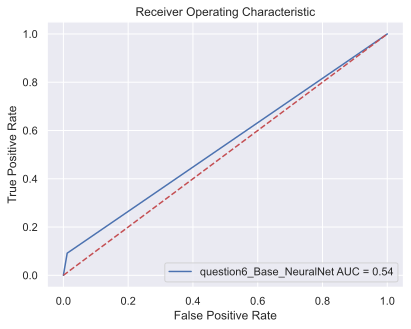</td>
    <td></td>  
  </tr>
  <tr>
    <td>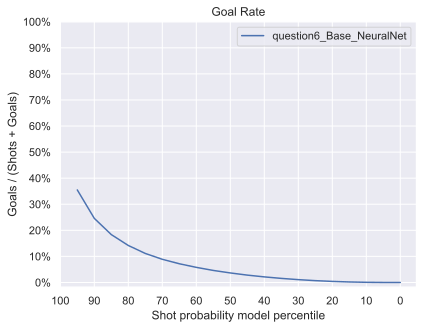</td>
    <td>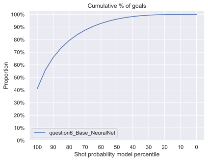</td>   
  </tr>  
</table>

On observe que le réseaux neuronaux ne fonctionne pas particulièrement mieux que les autres méthodes, le réseau ne prédit que des tirs. Cela est sûrement dû au débalancement des données, il y a beaucoup plus de tir que de but.

## Essait de différent type d'échantillonnage
Pour tenter de remédier à ce problème nous avons testé 3 différentes techniques d'échantillonnage.
### Réseaux neuronaux avec sur-échantillonnage
Ici on ne fait que dupliquer assez d'exemple de but pour avoir un nombre égale de but et de tir.

Modèle: [oversampling-neuralnet-model](https://www.comet.com/princesslove/model-registry/question6-oversampling-neuralnet-model)

Expérience: [oversampling-neuralnet-experience](https://www.comet.com/princesslove/itf-6758-team-4/315fbf1d69dd4045927f172cefdc3827?experiment-tab=chart&showOutliers=true&smoothing=0&transformY=smoothing&xAxis=wall)

<table>
 <tr>
    <th>Métrique</th>
    <th>Valeur</th>
  </tr>
  <tr>
    <td>Accuracy</td>
    <td>0.716</td>  
  </tr>
  <tr>
    <td>Precision</td>
    <td>0.559</td>   
  </tr>  
  <tr>
    <td>Recall</td>
    <td>0.646</td>   
  </tr>  
  <tr>
    <td>f score</td>
    <td>0.646</td>   
  </tr>  
  <tr>
    <td>AUC</td>
    <td>0.646</td>   
  </tr>  
</table>

<table>
  <tr>
    <td>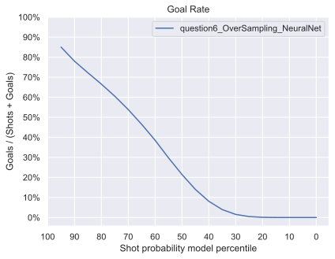</td>
    <td>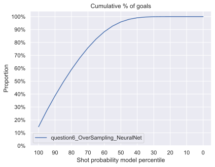</td>  
  </tr>
  <tr>
    <td>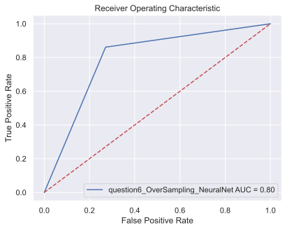</td>
    <td>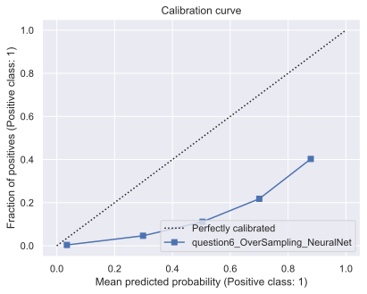</td>   
  </tr>  
</table>
Le modèle perd en Accuracy, mais il prédit des buts! 
### Réseaux neuronaux avec sous-échantillonnage
Ici, on retire assez de tirs pour avoir un nombre égal de tirs et de but. 

Modèle: [undersampling-neuralnet-model](https://www.comet.com/princesslove/model-registry/question6-undersampling-neuralnet-model)

Expérience: [undersampling-neuralnet-experience](https://www.comet.com/princesslove/itf-6758-team-4/2ebb21f1bc894143a0a237d4b873c77f?experiment-tab=chart&showOutliers=true&smoothing=0&transformY=smoothing&xAxis=wall)

<table>
 <tr>
    <th>Métrique</th>
    <th>Valeur</th>
  </tr>
  <tr>
    <td>Accuracy</td>
    <td>0.617</td>  
  </tr>
  <tr>
    <td>Precision</td>
    <td>0.541</td>   
  </tr>  
  <tr>
    <td>Recall</td>
    <td>0.618</td>   
  </tr>  
  <tr>
    <td>f score</td>
    <td>0.489</td>   
  </tr>  
  <tr>
    <td>AUC</td>
    <td>0.618</td>   
  </tr>  
</table>

<table>
  <tr>
    <td>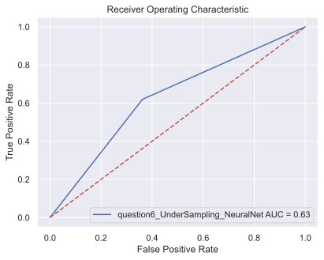</td>
    <td>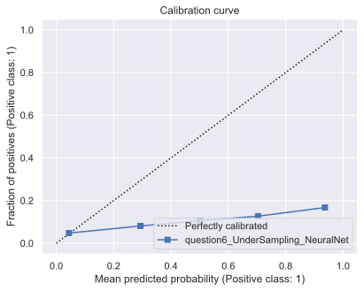</td>  
  </tr>
  <tr>
    <td>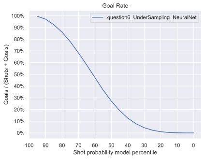</td>
    <td>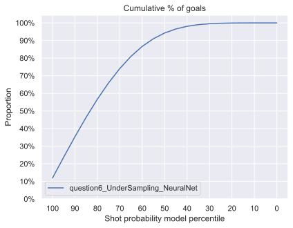</td>   
  </tr>  
</table>
Le modèle ne prédit plus que des tirs, mais performe moins bien qu'avec le sur-échantillonnage.
### Réseaux neuronaux avec SMOTE
Ici, la méthode SMOTE permet de créer des nouveaux exemples de but en créant de nouveaux points dans leur voisinage.

Modèle: [SMOTE-neuralnet-model](https://www.comet.com/princesslove/model-registry/question6-smote-neuralnet-model)

Expérience: [SMOTE-neuralnet-experience](https://www.comet.com/princesslove/itf-6758-team-4/b2410f1f88a747d9a0d2f08b4d266c40?experiment-tab=chart&showOutliers=true&smoothing=0&transformY=smoothing&xAxis=wall)

<table>
 <tr>
    <th>Métrique</th>
    <th>Valeur</th>
  </tr>
  <tr>
    <td>Accuracy</td>
    <td>0.747</td>  
  </tr>
  <tr>
    <td>Precision</td>
    <td>0.561</td>   
  </tr>  
  <tr>
    <td>Recall</td>
    <td>0.636</td>   
  </tr>  
  <tr>
    <td>f score</td>
    <td>0.558</td>   
  </tr>  
  <tr>
    <td>AUC</td>
    <td>0.636</td>   
  </tr>  
</table>

<table>
  <tr>
    <td>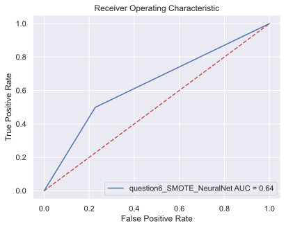</td>
    <td>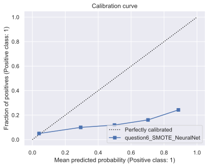</td>  
  </tr>
  <tr>
    <td>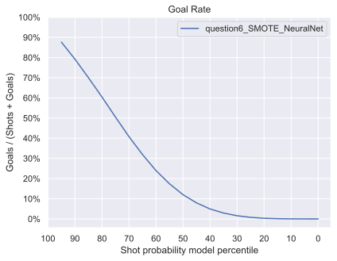</td>
    <td>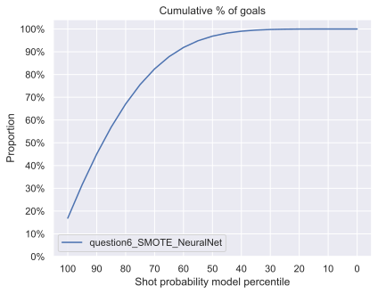</td>   
  </tr>  
</table>
Il s'agit de la meilleure technique d'échantillonnage testée. Elle permet de calibrer le modèle, mais d'aussi conserver une Accuracy acceptable. 
## Ajout des caractéristiques bonus de la supériorité numérique.

Pour cette étape nous ajoutons simplement les trois caractéristiques liées aux supérioritéa numériques.
### Réseaux neuronaux avec SMOTE et la supérioté numérique

Modèle: [SMOTE-Penalties-neuralnet-model](https://www.comet.com/princesslove/model-registry/question6-smote-with-penalties-neuralnet-model)

Expérience: [SMOTE-Penalties-neuralnet-experience](https://www.comet.com/princesslove/itf-6758-team-4/074a7a6225484f55b893922c16d200c0?experiment-tab=chart&showOutliers=true&smoothing=0&transformY=smoothing&xAxis=wall)

<table>
 <tr>
    <th>Métrique</th>
    <th>Valeur</th>
  </tr>
  <tr>
    <td>Accuracy</td>
    <td>0.762</td>  
  </tr>
  <tr>
    <td>Precision</td>
    <td>0.561</td>   
  </tr>  
  <tr>
    <td>Recall</td>
    <td>0.628</td>   
  </tr>  
  <tr>
    <td>f score</td>
    <td>0.562</td>   
  </tr>  
  <tr>
    <td>AUC</td>
    <td>0.628</td>   
  </tr>  
</table>

<table>
  <tr>
    <td>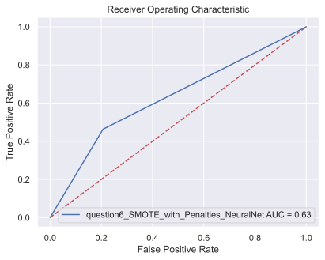</td>
    <td>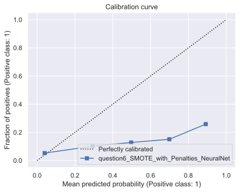</td>  
  </tr>
  <tr>
    <td>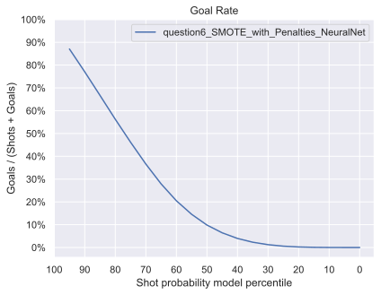</td>
    <td>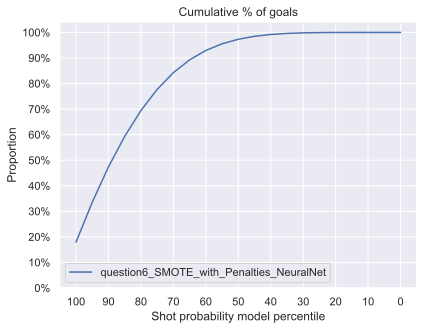</td>   
  </tr>  
</table>
On observe une amélioration de 2% de l'Accuracy, ainsi qu'une légère amélioration du f_score de 0.004.
## Calibration du seuil de prédiction
Puisque les données n'étaient pas balancées nous avons utilisé des méthodes d'échantillonnage. 
Parcontre il y a en général 10 fois moins de buts que de tirs ratés. Alors pour améliorer davantage les prédictions nous allons tenter de trouver le meilleur seuil prédiction basé sur le f1_score.
Pour ce faire, nous testons simplement différents seuils et trouvons celui qui optimise la métrique f1_score.

 
### Réseaux neuronaux avec SMOTE, les PowerPlay et calibration du seuil
Le meilleur seuil de prédiction pour optimiser le f1_score a été trouvé à 0.8.

Modèle: [SMOTE-Penalties-Threshold-0.8-neuralnet-model](https://www.comet.com/princesslove/model-registry/question6-smote-with-penalties-t-0-8-neuralnet-model)

Expérience: [SMOTE-Penalties-Threshold-0.8-neuralnet-experience](https://www.comet.com/princesslove/itf-6758-team-4/c389af2961314320b5fa0bad84bdfc39?experiment-tab=chart&showOutliers=true&smoothing=0&transformY=smoothing&xAxis=wall)

<table>
 <tr>
    <th>Métrique</th>
    <th>Valeur</th>
  </tr>
  <tr>
    <td>Accuracy</td>
    <td>0.864</td>  
  </tr>
  <tr>
    <td>Precision</td>
    <td>0.59</td>   
  </tr>  
  <tr>
    <td>Recall</td>
    <td>0.583</td>   
  </tr>  
  <tr>
    <td>f score</td>
    <td>0.583</td>   
  </tr>  
  <tr>
    <td>AUC</td>
    <td>0.583</td>   
  </tr>  
</table>

<table>
  <tr>
    <td>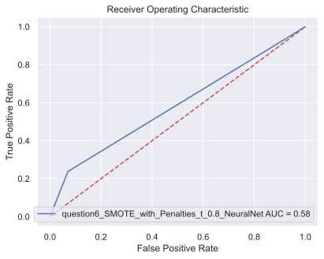</td>
    <td>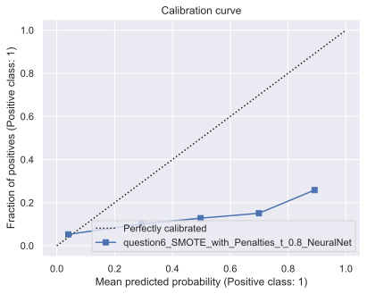</td>  
  </tr>
  <tr>
    <td>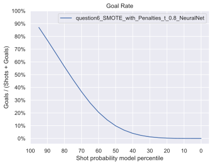</td>
    <td>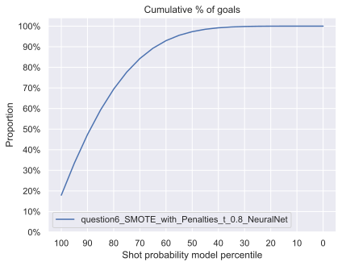</td>   
  </tr>  
</table>

Matrices de confusion pour le seuil de base et le seuil optimal.
<table>
   <tr>
    <th>Seuil 0.5</th>
    <th>Seuil 0.8</th>
  </tr>  
  <tr>
    <td>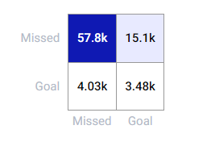</td>
    <td>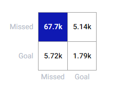</td>  
  </tr>
</table>

On gagne 10% d'Accuracy. L'effet recherché se percoit dans les matrices de confusions, moins de but sont prédits.

Il s'agit de notre meilleur modèle pour la partie 6. 

# 7. Évaluer sur l'ensemble de test 

## 7.1 La saison régulière
<table>
 <tr>
    <th>Modèle</th>
    <th>Accuracy</th>
    <th>Precision</th>
    <th>Recall</th>
    <th>f score</th>
    <th>AUC</th>
  </tr>
  <tr>
    <td>LR with distance</td>
    <td>0.902</td>
    <td>0.451</td>
    <td>0.500</td>
    <td>0.474</td>
    <td>0.500</td> 
  </tr>
  <tr>
    <td>LR with angle</td>
    <td>0.902</td>
    <td>0.451</td>
    <td>0.500</td>
    <td>0.474</td>
    <td>0.500</td> 
  </tr>  
  <tr>
    <td>LR with distance and angle</td>
    <td>0.902</td>
    <td>0.451</td>
    <td>0.500</td>
    <td>0.474</td>
    <td>0.500</td>    
  </tr>  
  <tr>
    <td>XGB</td>
    <td>0.858</td>
    <td>0.606</td>
    <td>0.615</td>
    <td>0.610</td>
    <td>0.615</td>   
  </tr>  
  <tr>
    <td>NN</td>
    <td>0.869</td>
    <td>0.599</td>
    <td>0.579</td>
    <td>0.587</td>
    <td>0.579</td>   
  </tr>  
</table>
<table>
  <tr>
    <td>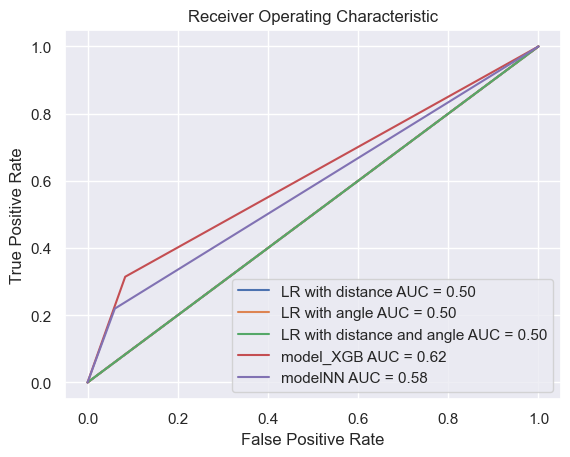</td>
    <td>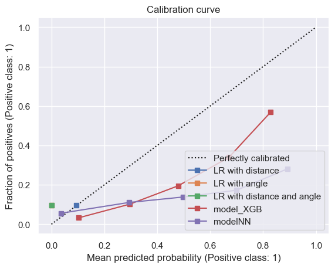</td>  
  </tr>
  <tr>
    <td>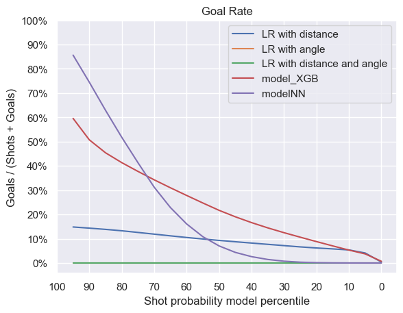</td>
    <td>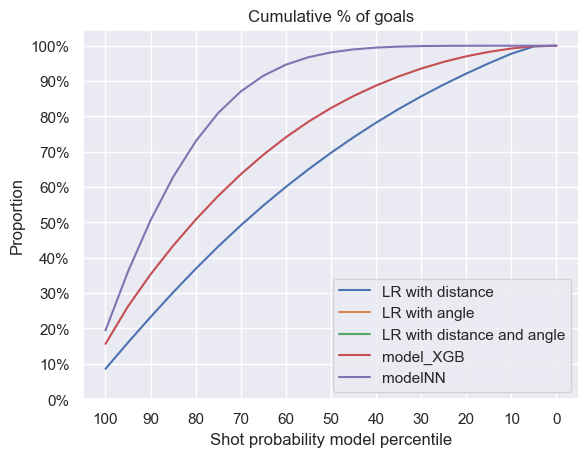</td>   
  </tr>  
</table>

