<h1> 2. Ingénierie des caractéristiques I </h1>

### 2.1 


<figure>
    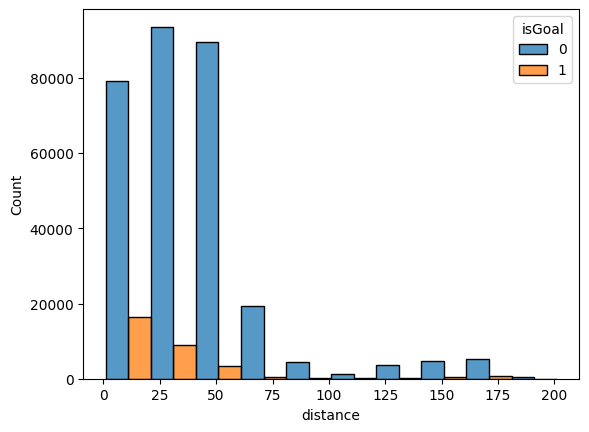
</figure>

Cette figure représente un histogramme du nombre de tirs séparés en buts et non-buts, regroupés par distance. La figure nous montre qu'il y a un plus grand nombre de buts pour pour les distances courtes. C'est également le cas pour le nombre de non-buts, qui sont plus élevés pour les distances courtes. De manière générale, nos données nous indiquent que plus on est proche du filet, plus le nombre de tirs (buts et non-buts) est élevé. 

<figure>
    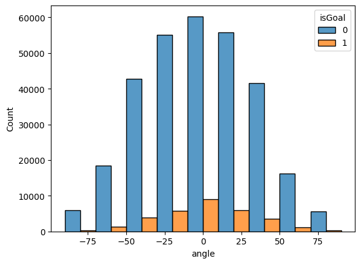
</figure>

Cette figure représente un histogramme du nombre de tirs séparés en buts et non-buts regroupés par angle. En observant notre histogramme, nous remarquons que le plus grand nombre de buts se trouve dans un intervalle d'angle de tir assez faible. Dans notre cas, 0° semble être le meilleur angle de tir pour avoir un but. En effet, les joueurs qui tirent plus ou moins droit (face au filet) ont une meilleure chance de marquer un but.

<figure>
    
</figure>

Cette figure représente un histogramme 2D avec l'axe x (la distance) et l'axe y (l'angle). Dans cet histogramme, aucune séparation des tirs n'a été appliquée (buts et non-buts confondus). Cet histogramme en 2D nous permet d'analyser deux caractéristiques en même temps (distance, angle) et leur influence sur le nombre de tirs sans distinction de type. L'histogramme nous indique le plus grand nombre de tirs se fait près du filet (courte distance) et plus ou moins face au filet (angle proche de 0°).


### 2.2 

<figure >
    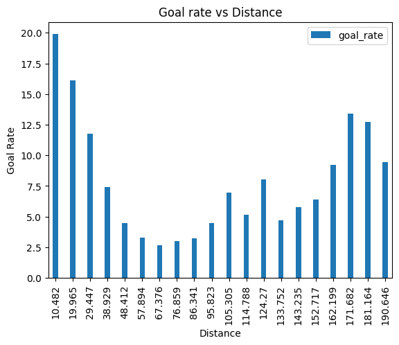
</figure>

Cette figure montre la relation entre le taux de buts et la distance. Le taux de buts est plus élevé pour les courtes distances. Une fois de plus, on remarque que se tenir près du filet augmente la probabilité de marquer un but. 

<figure>
    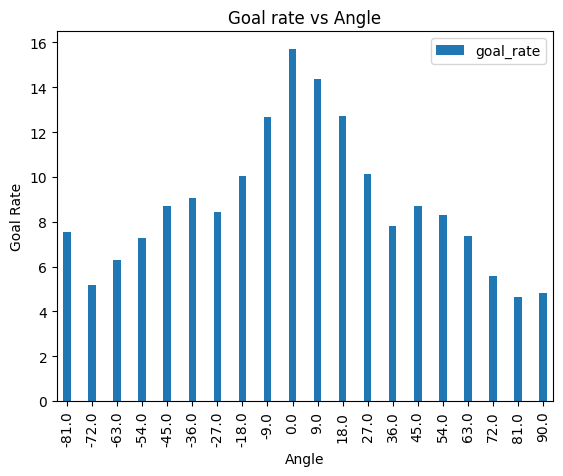
</figure>

Cette figure montre la relation entre le taux de buts et l'angle de tir. Le taux de buts est plus élevé pour les angles proches de 0, face au filet.

### 2.3 

<figure >
    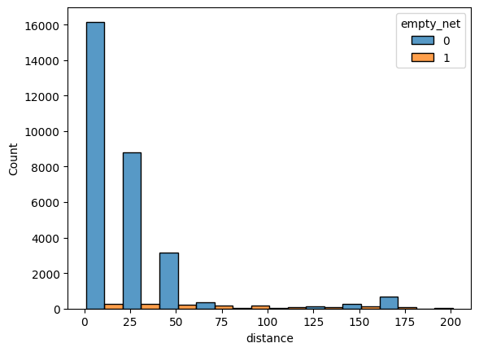
</figure>

Cette figure répresente un histogramme de buts classés par distance et montre la répartition des évènements nets vides et non-vides. La figure montre clairement qu'il y a beaucoup plus de buts avec filet non-vide lorsque la distance est courte. Il est donc plus compliqué de marquer un but avec filet non-vide (non-empty net) à une distance plus grande.  

La connaissance du domaine dit qu'« il est incroyablement rare de marquer un **but net non vide** sur l'équipe adverse depuis l'intérieur de votre zone défensive ».

On peut se baser sur notre observation précédente sur les nets vides et non vides pour rechercher des données qui pourraient être incorrectes. De plus, en s'appuyant sur ce que dit la connaissance du domaine, on pourrait vérifier si un but a été marqué avec un net non-vide à une distance très éloignée. En appliquant quelques conditions sur notre ensemble de données, on a pu générer une liste de buts marqués avec un net non-vide et classée de manière décroissante par rapport à la colonne de distance. 

C'est le cas pour le match Detroit Red Wings - Florida Panthers (id: 2016020510) on December,23rd 2016 qui correspond au but marqué (Florida Panthers) à la distance la plus éloignée (**188.17545**) avec un net non vide dans notre ensemble de données. En regardant la vidéo du match (**00:45s**), on peut clairement voir que le but a été marqué à une distance proche du filet. Nous pouvons donc conclure que ces données sont incorrectes.

https://youtu.be/We-JH8xWf1M


<h1> 3. Modèles de base </h1>

### 3.1 
 
Nous avons utilisé notre ensemble de données séparé en deux ensembles d'entrainement et de validation. Nous avons ensuite entrainé un classifieur de Logistic Regression en utilisant la caractéristique de distance avec les paramètres de défaut. Cela nous a permis d'obtenir la précision de notre modèle sur l'ensemble de validation.

La précision du modèle obtenu : 
*Accuracy*: 0.906208

On remarque que notre modèle donne toujours une prédiction de 0, et donc toujours un non-but. Un problème potentiel qui pourrait expliquer cette situation est le débalancement de notre ensemble de données. En effet, notre ensemble de données est constitué de 31095 buts (9.345%) et 301647 non-buts (90.655%). Le pourcentage de non-buts est tellement élevé par rapport à celui des buts que le modèle donne de fausses prédictions. 


### 3.2 et 3.3 


<figure >
    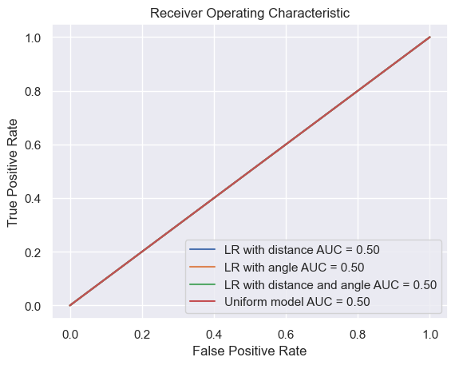
</figure>

Cette figure montre les courbes ROC pour les différents modèles. On remarque que tous les modèles ont la même valeur de AUC et qu'il n'y a pas de distinction avec le model uniforme. 


<figure>
    
</figure>

Cette figure montre les courbes de calibration (calibration curve) pour les différents modèles. On constate que nos 03 modèles de Logistic Regression sont représentés en un et seul même point qui est placé très bas. Cette observation nous indique que la calibration n'est pas bonne.

<figure>
    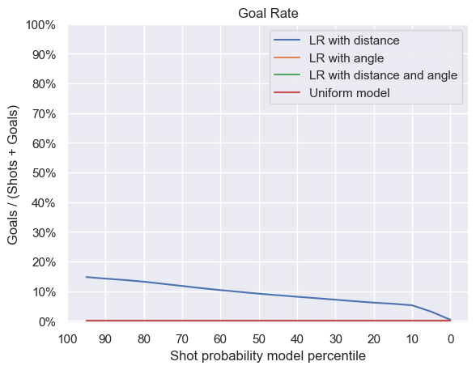
</figure>

Cette figure montre les courbes de taux de buts (goal rate) pour les différents modèles. Vu que notre modèle de Logistic Regression donne de fausses prédictions, on constate que le taux de buts diminue pour des valeurs faibles de 'shot probability model percentile'.

<figure>
    
</figure>

Cette figure montre les courbes de proportion cumulée de buts pour les différents modèles. Comme le modèle prédit toujours des non-buts, on en déduit que la figure ne nous apporte pas d'informations correctes.


### 3.4
### 

Modèle: [question3-1-model](https://www.comet.com/princesslove/model-registry/question3-1-model)

Expérience: [question3.1](https://www.comet.com/princesslove/itf-6758-team-4/d29c9bc2c94c4051b212c645f2146bd4?experiment-tab=chart&showOutliers=true&smoothing=0&transformY=smoothing&xAxis=wall)

<table>
 <tr>
    <th>Métrique</th>
    <th>Valeur</th>
  </tr>
  <tr>
    <td>Accuracy</td>
    <td>0.906</td>  
  </tr>
  <tr>
    <td>AUC</td>
    <td>0.5</td>   
  </tr>  
  <tr>
    <td>f_score</td>
    <td>0.475</td>   
  </tr>  
  <tr>
    <td>Precision</td>
    <td>0.453</td>   
  </tr>  
  <tr>
    <td>Recall</td>
    <td>0.5</td>   
  </tr>  
</table>

<table>
  <tr>
    <td></td>
    <td></td>  
  </tr>
  <tr>
    <td></td>
    <td>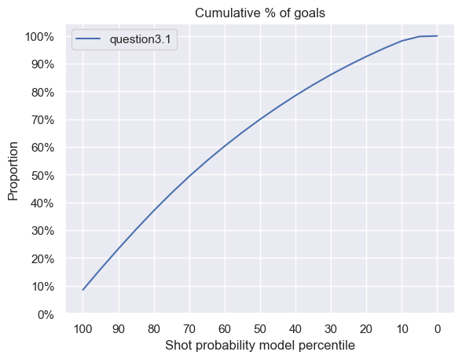</td>   
  </tr>  
</table>


Modèle: [question3-2-model](https://www.comet.com/princesslove/model-registry/question3-2-model)

Expérience: [question3.2](https://www.comet.com/princesslove/itf-6758-team-4/16bdcf3ef5bc47a4bcb298b02bf8cac0?experiment-tab=chart&showOutliers=true&smoothing=0&transformY=smoothing&xAxis=wall)

<table>
 <tr>
    <th>Métrique</th>
    <th>Valeur</th>
  </tr>
  <tr>
    <td>Accuracy</td>
    <td>0.906</td>  
  </tr>
  <tr>
    <td>AUC</td>
    <td>0.5</td>   
  </tr>  
  <tr>
    <td>f_score</td>
    <td>0.475</td>   
  </tr>  
  <tr>
    <td>Precision</td>
    <td>0.453</td>   
  </tr>  
  <tr>
    <td>Recall</td>
    <td>0.5</td>   
  </tr>  
</table>

<table>
  <tr>
    <td></td>
    <td></td>  
  </tr>
  <tr>
    <td></td>
    <td></td>   
  </tr>  
</table>


Modèle: [question3-3-model](https://www.comet.com/princesslove/model-registry/question3-3-model)

Expérience: [question3.3](https://www.comet.com/princesslove/itf-6758-team-4/39b4bad6f6cc457f9fb1abcb5d26cf8e?experiment-tab=chart&showOutliers=true&smoothing=0&transformY=smoothing&xAxis=wall)

<table>
 <tr>
    <th>Métrique</th>
    <th>Valeur</th>
  </tr>
  <tr>
    <td>Accuracy</td>
    <td>0.906</td>  
  </tr>
  <tr>
    <td>AUC</td>
    <td>0.5</td>   
  </tr>  
  <tr>
    <td>f_score</td>
    <td>0.475</td>   
  </tr>  
  <tr>
    <td>Precision</td>
    <td>0.453</td>   
  </tr>  
  <tr>
    <td>Recall</td>
    <td>0.5</td>   
  </tr>  
</table>

<table>
  <tr>
    <td>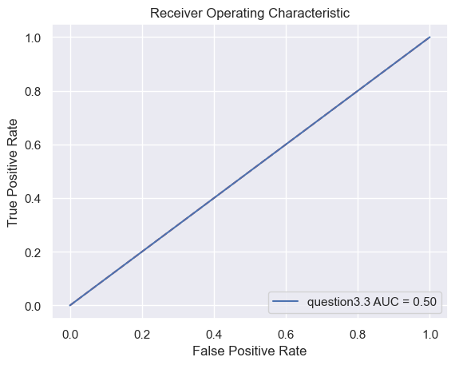</td>
    <td></td>  
  </tr>
  <tr>
    <td>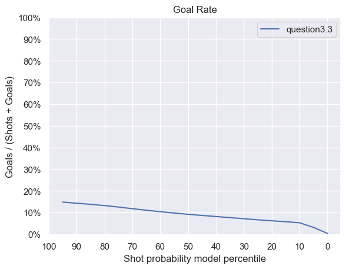</td>
    <td></td>   
  </tr>  
</table>


<h1>4. Ingénierie des caractéristiques II </h1>

<table>
  <tr>
    <th>Caractéristique</th>
    <th>Nom de la colonne</th>
    <th>Description</th>
  </tr>
  <tr>
    <td>Coordonnées</td>
    <td>x_coord et y_coord</td>
    <td>Coordonnées de l'événement</td>
  </tr>
  <tr>
    <td>Distance</td>
    <td>distance</td>
    <td>Distance entre le joueur et le but adverse</td>
  </tr>
  <tr>
    <td>Angle</td>
    <td>angle</td>
    <td>Angle entre le joueur et le but</td>
  </tr>
  <tr>
    <td>Type de tir</td>
    <td>shot_type</td>
    <td>Type du tir effectué (ex: Slap Shot)</td>
  </tr>
  <tr>
    <td>Filet désert</td>
    <td>empty_net</td>
    <td>Vrai si le filet est désert</td>
  </tr>
  <tr>
    <td>Dernier événement</td>
    <td>last_event_type</td>
    <td>Type du dernier événement (ex: Faceoff)</td>
  </tr>
  <tr>
    <td>Coordonnées du dernier événement</td>
    <td>last_x_coord et last_y_coord </td>
    <td>Coordonnées du dernier événement</td>
  </tr>
  <tr>
    <td>Distance avec le dernier événement</td>
    <td>distance_from_last</td>
    <td>Distance entre le tir et le dernier événement</td>
  </tr>
  <tr>
    <td>Temps depuis le dernier événement</td>
    <td>seconds_since_last</td>
    <td>Temps entre le tir et le dernier événement</td>
  </tr>
  <tr>
    <td>Rebond</td>
    <td>Rebound</td>
    <td>Vrai l'événement précédent est un tir</td>
  </tr>
  <tr>
    <td>Changement d'angle</td>
    <td>angle_change</td>
    <td>Différence d'angle entre ce tir et le tir précédent</td>
  </tr>
  <tr>
    <td>Vitesse</td>
    <td>speed</td>
    <td>Vitesse entre l'événement actuelle et le précédent </td>
  </tr>
  <tr>
    <td>Supériorité numérique</td>
    <td>powerplay</td>
    <td>Vrai, si l'équipe attaquante a plus de joueur sur la glace que l'équipe qui défend</td>
  </tr>
  <tr>
    <td>Nombre de joueurs de l'équipe attaquante</td>
    <td>team_that_shot_nb</td>
    <td>Nombre de joueurs non-gardiens de l'équipe attaquante</td>
  </tr>
  <tr>
    <td>Nombre de joueurs non-gardiens de l'équipe défendante</td>
    <td>other_team_nb</td>
    <td>Nombre de joueur de l'équipe défendante</td>
  </tr>
</table>
<h2> 4.4 Bonus: supériorité numérique </h2>
Nous avons ajouté trois caractéristiques supplémentaires qui améne de l'information sur la supériorité numérique d'une équipe par rapport à l'autre (PowerPlay) : 
- 'powerplay' : booléen définnissant si l'équipe attaquante a plus de joueurs sur la glace que l'équipe qui défend.
- 'team_that_shot_nb' : Nombre de patineurs non-gardiens de l'équipe attaquante.
- 'other_team_nb' : Nombre de patineurs non-gardiens de l'équipe défendante.

Quelques détails concernant notre implémentation:

- Nos pénalités sont calculées de sorte qu' elles soient transférables d'une période à une autre. 

- Une troisième pénalité qui ferait en sorte que moins de trois joueurs soient sur la glace est simplement ignorée. 

- Les pénalités 'Misconduct' sont elles aussi ignorées car elles n'affectent pas le nombre de joueurs sur la glace. 

- Lorsqu'un but est marqué par une équipe en supériorité numérique, la pénalité mineure ayant le moins de temps restant de l’autre équipe est annulée. 

- Similairement au point précédent, si un joueur possède plusieurs pénalités dont une mineure, deux minutes seront retranchées à son temps total. 


<h1>5. Modèles avancés </h1>
<h1>5.1. XGboost avec comme features l'angle et la distance</h1>

Expérience: [question 5.1](https://www.comet.com/princesslove/itf-6758-team-4/da3d1de95f164994a69ecd8be274747f?experiment-tab=chart&showOutliers=true&smoothing=0&transformY=smoothing&xAxis=wall)


<table>
 <tr>
    <th>Métrique</th>
    <th>Valeur</th>
  </tr>
  <tr>
    <td>Accuracy</td>
    <td>0.906</td>  
  </tr>
  <tr>
    <td>Precision</td>
    <td>0.697</td>   
  </tr>  
  <tr>
    <td>Recall</td>
    <td>0.501</td>   
  </tr>  
  <tr>
    <td>f score</td>
    <td>0.478</td>   
  </tr>  
  <tr>
    <td>AUC</td>
    <td>0.501</td>   
  </tr>  
</table>

<table>
  <tr>
    <td></td>
    <td></td>  
  </tr>
  <tr>
    <td></td>
    <td></td>   
  </tr>  
</table>

Commentaires : Pour toutes les expériences nous avons divisé nos données d'entrainements en données d'entrainements et de validations. Cela nous permet de configurer nos modèles tout en nous laissant la possibilité de vérifier que ces paramètres se généralisent à de nouvelles données (ici nos données de test).

Pour cette division, nous avons défini un seed commun à toutes les expériences pour pouvoir les comparer (seed fixé à 42) et on a également stratifié les données pour avoir la même répartition de label à "Goal" sur l'ensemble de données. En effet, les "Goals" étant minoritaires on veut qu'il y en ait assez dans l'ensemble d'entraînement pour que le modèle apprenne à les reconnaître et, on veut qu'il y en ait assez dans l'ensemble de validation pour avoir une évaluation pertinente.

Finalement, on peut voir que, juste avec ces 2 features (distance et angle), le XGBoost performe mieux que la régression logistique puisqu'il parvient à prédire des buts ('Goals').

Les courbes de calibration montrent que le modèle XGboost est quasiment parfaitement calibré. Tandis que, que les régressions logistiques ne pouvaient pas être calibrées puisqu'ils ne prédisaient que des tirs (non-buts).


<h1>5.2. XGboost paramétré avec toutes les features</h1>

Modèle:[question 5.2](https://www.comet.com/princesslove/model-registry/question5-2-with-grid-search-json-model)

Expérience: [question 5.2](https://www.comet.com/princesslove/itf-6758-team-4/93f37095918649eea592e37100e8f278?experiment-tab=chart&showOutliers=true&smoothing=0&transformY=smoothing&xAxis=wall)

Commentaires :

Pour le réglage d'hyper paramètres nous avons réalisé un random search avec un stratified 5-fold cross validation et 100 combinaisons testées. En tout, cela a pris 30-40 minutes pour un total de 500 fits. Le f1 score macro a été utilisé comme métrique pour la sélection des meilleurs hyperparamètres. Les paramètres testés sont les suivants :


```python
param_grid = {'gamma': [0,0.1,0.2,0.4,0.8,1.6,3.2,6.4,12.8,25.6],
              'learning_rate': [0.01, 0.1, 0.2, 0.3, 0.5],
              'scale_pos_weight' : [2,3,4,5,6,7],
              'max_depth': [5,6,7,8,9,10,11,12,13,14],
              'n_estimators': [50,65,80,100,115,130,150],
              'reg_alpha': [0,0.1,0.2,0.4,0.8,1.6,3.2,6.4,12.8,25.6,51.2,102.4,200],
              'reg_lambda': [0,0.1,0.2,0.4,0.8,1.6,3.2,6.4,12.8,25.6,51.2,102.4,200],
              'max_delta_step' : [1,2,3,4,5,6,7,8,9,10],
              'min_child_weight': [1, 5, 10],
              'subsample': [0.6, 0.8, 1.0],
              'colsample_bytree': [0.6, 0.8, 1.0],
              'lambda':[0.4, 0.6,0.8,1],
              'alpha':[0, 0.2,0.4,0.6],
            }

```
Notamment nous avons remarqué que le paramètre 'scale_pos_weight' était très déterminant dans les performances du modèle. En effet, il permet de gérer le débalancement des données.

avec 3 autres paramètres définis comme suit :
```python
model = XGBClassifier(objective='binary:logistic',
                        predictor='cpu_predictor',
                        tree_method = 'hist')
```

Nous avons défini la fonction objective comme celle par défaut pour une classification binaire, le paramètre predictor='cpu_predictor' permet un calcul plus rapide et de même pour tree_method = 'hist' qui permet de faire un binning jusqu'à un maximum de 255 bins sur les features continues.

<table>
 <tr>
    <th>Métrique</th>
    <th>Valeur</th>
  </tr>
  <tr>
    <td>Accuracy</td>
    <td>0.876</td>  
  </tr>
  <tr>
    <td>Precision</td>
    <td>0.631</td>   
  </tr>  
  <tr>
    <td>Recall</td>
    <td>0.626</td>   
  </tr>  
  <tr>
    <td>f score</td>
    <td>0.629</td>   
  </tr>  
  <tr>
    <td>AUC</td>
    <td>0.626</td>   
  </tr>  
</table>

<table>
  <tr>
    <td></td>
    <td></td>  
  </tr>
  <tr>
    <td></td>
    <td></td>   
  </tr>  
</table>


***Commentaires :***

On observe que les résultats ont nettement augmenté. La courbe ROC n'est plus alignée à une droite linéaire équivalente à un modèle random. On passe de 0.501 à 0.626 de AUC. Cela vient principalement de l'argument 'scale_pos_weight' qui gère l'imbalancement des données. En contrepartie, on a un modèle qui n'est pas calibré. Par conséquent, considérer que les probabilités en dessous de 0.5 sont des 'Shots' et ceux au-dessus sont des 'Goals' n'est pas la solution optimale mais, reste une solution satisfaisante. C'est avec ce seuil de 0.5 que nous avons calculé les autres métriques (accuracy, f1-score, precision, recall et AUC).


NB : On pourrait calibrer le modèle avec la fonction [CalibratedClassifierCV](https://scikit-learn.org/stable/modules/generated/sklearn.calibration.CalibratedClassifierCV.html) de sklearn.


<h2>5.3. XGboost paramétré avec features selection</h2>

Pour cette partie on a testé plusieurs techniques de sélection de features.

<h3>5.3.1 Sélection avec Shap</h3>

Expérience: [XGBoost avec Shap](https://www.comet.com/princesslove/itf-6758-team-4/173fd21ad5824b2897a136f2598e84d0?experiment-tab=chart&showOutliers=true&smoothing=0&transformY=smoothing&xAxis=wall)

Tout d'abord nous avons évalué quelles features/caractéristiques étaient les plus importantes pour les prédictions du modèle XGBoost que nous avons paramétré plus tôt. Pour cela, nous avons utilisé la librairie [SHAP](https://github.com/slundberg/shap).

<table>
  <tr>
    <td></td>
    <td></td>  
  </tr>
</table>

Après avoir visualisé les features qui aident le plus notre modèle, on a décidé de ne sélectionner que les features donnant un score shape supérieur à 0.02 (en valeur absolue).

<h3>5.3.2 Suppression des redondances avec une HeatMap</h3>

Tout d'abord nous avons plot le heatmap des features pour observer et supprimer les redondances. Notamment, nous avons supprimé la feature 'last_event_type_Shot' qui est très fortement corrélé à "rebound". "rebound" étant plus corrélé à notre target "result_event" nous avons préféré le conserver.

<figure >
    
</figure>


Après cette première sélection de features basée sur le heatmap nous avons testé différentes sélections de features. ***Pour chacune d'entre elles nous avons supprimé au préalable la redondance 'last_event_type_Shot'***.

<h3> 5.3.3 Sélection de features basé sur la variance </h3>

Expérience: [XGBoost avec Variance](https://www.comet.com/princesslove/itf-6758-team-4/c1fb955779bb423fa09e199aa81eb884?experiment-tab=chart&showOutliers=true&smoothing=0&transformY=smoothing&xAxis=wall)

[VarianceThreshold](https://scikit-learn.org/stable/modules/generated/sklearn.feature_selection.VarianceThreshold.html) qui permet de supprimer toutes les features à faible variance.
  
```python 
selector = VarianceThreshold(threshold=0.95)
```

Cette méthode conserve toutes les features dans notre cas.

<h3> 5.3.4 Sélection de features basé sur le LASSO</h3>

Expérience: [XGBoost avec Lasso](https://www.comet.com/princesslove/itf-6758-team-4/7e5f4b37f13740b484415676a5b7f507?experiment-tab=chart&showOutliers=true&smoothing=0&transformY=smoothing&xAxis=wall)


Lasso that we computed using sklearn libraries [SelectModel](https://scikit-learn.org/stable/modules/generated/sklearn.feature_selection.SelectFromModel.html) and the model [LinearSVC](https://scikit-learn.org/stable/modules/generated/sklearn.svm.LinearSVC.html)

Voici comment nous avons réalisé le LASSO : 

```python
xgb_lasso = Pipeline([
  ('feature_selection', SelectFromModel(LinearSVC(C=0.001, penalty="l1", dual=False))),
  ('classification', XGBClassifier(scale_pos_weight = 4))
])
```

Le lasso supprime de sa sélection les features : 'periodTime','x_coord', 'angle','last_x_coord', 'last_y_coord', 'angle_change' 'shot_type_Backhand','shot_type_Slap Shot', 'last_event_type_Blocked Shot', 'last_event_type_Missed Shot',

<h3>5.3.5 Sélection de features basé sur le Sequential forward/backward</h3>

On a pensé et essayé d'appliquer cette méthode mais elle est très coûteuse en temps et nous avons donc abandonné l'idée.

<h3>5.3.6 Sélection de features basé une métrique</h3>

Expérience: [XGBoost avec fKBest](https://www.comet.com/princesslove/itf-6758-team-4/e167b9f118394c85a661d47d3c5b4b64?experiment-tab=chart&showOutliers=true&smoothing=0&transformY=smoothing&xAxis=wall)


L'idée est de séléctionner les k best features en se basant sur la métirque [f_classif](https://scikit-learn.org/stable/modules/generated/sklearn.feature_selection.f_classif.html#sklearn.feature_selection.f_classif).

Pour choisir le nombre k de features optimales nous les avons toutes testées en les évaluant sur 4 métriques (Accuracy, f1 score, precision et recall).


<figure >
    
</figure>

Finalement c'est pour k=28 que les meilleurs résultats sont obtenus.
***La méthode des k best exclus la feature 'x_coord' de sa séléction.***

<h3> 5.3.7 Comparaison des méthodes de séléctions</h3>

Finalement, nous avons comparé toutes ces sélections entre elles en utilisant le même paramétrage de modèle XGBoost suivant :

```python
 model = XGBClassifier(scale_pos_weight = 4)
```
Ce choix de paramétrage a été fait pour atténuer le débalancement des données. Suite à cette comparaison nous avons conclu que la meilleure sélection était tout simplement de prendre toutes les features sauf les redondantes, c'est-à-dire le 'last_event_type_Shot' dans notre cas.

Voici les figures comparant les résultats des sélections de features.

<table>
  <tr>
  <td></td>
  <td></td>  
  </tr>
  <tr>
    <td></td>
    <td></td>   
  </tr>  
</table>


Tableau présentant les résultats des différentes sélections de caractéristiques selon différentes métriques.

<figure >
    
</figure>

NB:
- all_fts : toutes les features/caractéristiques sans exception (même les redondantes). (Experience : [XGBoost avec toutes les features](https://www.comet.com/princesslove/itf-6758-team-4/5a2d2a2cc121456389eecf91a5601723?experiment-tab=chart&showOutliers=true&smoothing=0&transformY=smoothing&xAxis=wall)
- shap :  les features/caractéristiques selectionnées par analyse des SHAP values et avec suppression de redondances.
- variance : features/caractéristiques selectionnées avec la méthode de la variance (après suppression de redondances). Dans notre cas, cela revient à considérer toutes les features sauf les redondantes, car la méthode de la variance ne fait aucune sélection.
- lasso : features/caractéristiques selectionnées avec la méthode LASSO (après suppression de redondances).
- fKBest : les 28 meilleurs features/caractéristiques en se basant sur le f_classif score (après suppression de redondances).


On observe que les résultats entre toutes ces sélections sont assez similaires. La sélection avec les valeurs Shap était peut être un peu brutale, il aurait fallu considérer un plus grand nombre de features peut être dans ce cas.

<h3> 5.3.8 Grid Search avec les meilleurs features/caractéristiques sélectionnées </h3>

Modèle:[question 5.3](https://www.comet.com/princesslove/model-registry/question5-3-grid-search-fts-selected-model)

Expérience: [question 5.3](https://www.comet.com/princesslove/itf-6758-team-4/38505bd6308c472084e1f4d53f7d650a?experiment-tab=chart&showOutliers=true&smoothing=0&transformY=smoothing&xAxis=wall)

<table>
 <tr>
    <th>Métrique</th>
    <th>Valeur</th>
  </tr>
  <tr>
    <td>Accuracy</td>
    <td>0.875</td>  
  </tr>
  <tr>
    <td>Precision</td>
    <td>0.632</td>   
  </tr>  
  <tr>
    <td>Recall</td>
    <td>0.631</td>   
  </tr>  
  <tr>
    <td>f score</td>
    <td>0.631</td>   
  </tr>  
  <tr>
    <td>AUC</td>
    <td>0.631</td>   
  </tr>  
</table>

<table>
  <tr>
  <td></td>  
    <td></td>
    
  </tr>
  <tr>
    <td></td>
    <td></td>   
  </tr>  
</table>


Commentaire :

Les résultats au niveau des courbes n'ont pas vraiment évolué et, cela parce que nous n'avons que supprimé une feature/caractéristique parmi toutes les autres. Toutefois, les résultats ont augmenté puisqu'on passe de 62.6% de AUC à 63.1% de AUC.

NB: à noter que toutes les combinaisons des paramètres n'ont pas été testé, car on a réalisé un RandomSearch. Par conséquent, une part de l'écart entre ces résultats peut provenir d'un meilleur paramétrage.


<h1>6. Faites de votre mieux! </h1>
Les expériences suivantes peuvent être recréées avec le cahier Jupyter Part_2-Q6.ipynb.

<h2> Réseaux neuronaux entrainés avec toutes les caractéristiques sauf les PowerPlay</h2>

Pour entraîner les réseaux neuronaux nous avons utilisé une architecture de Multi-Layer Perceptron avec (100,50,50,20) comme dimension des couches cachées.

Modèle: [base-neuralnet-model](https://www.comet.com/princesslove/model-registry/question6-base-neuralnet-model)

Expérience: [base-neuralnet-experience](https://www.comet.com/princesslove/itf-6758-team-4/4e3809e3f5834115bbf6dabf30e2a3bb?experiment-tab=chart&showOutliers=true&smoothing=0&transformY=smoothing&xAxis=wall)
<table>
 <tr>
    <th>Métrique</th>
    <th>Valeur</th>
  </tr>
  <tr>
    <td>Accuracy</td>
    <td>0.901</td>  
  </tr>
  <tr>
    <td>Precision</td>
    <td>0.65</td>   
  </tr>  
  <tr>
    <td>Recall</td>
    <td>0.54</td>   
  </tr>  
  <tr>
    <td>f score</td>
    <td>0.55</td>   
  </tr>  
  <tr>
    <td>AUC</td>
    <td>0.54</td>   
  </tr>  
</table>

<table>
  <tr>
    <td></td>
    <td>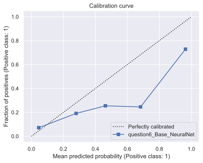</td>  
  </tr>
  <tr>
    <td></td>
    <td></td>   
  </tr>  
</table>

On observe que le réseaux neuronaux ne fonctionne pas particulièrement mieux que les autres méthodes, le réseau ne prédit que des tirs. Cela est sûrement dû au débalancement des données, il y a beaucoup plus de tir que de but.

## Essait de différent type d'échantillonnage
Pour tenter de remédier à ce problème nous avons testé 3 différentes techniques d'échantillonnage.
### Réseaux neuronaux avec sur-échantillonnage
Ici on ne fait que dupliquer assez d'exemple de but pour avoir un nombre égale de but et de tir.

Modèle: [oversampling-neuralnet-model](https://www.comet.com/princesslove/model-registry/question6-oversampling-neuralnet-model)

Expérience: [oversampling-neuralnet-experience](https://www.comet.com/princesslove/itf-6758-team-4/315fbf1d69dd4045927f172cefdc3827?experiment-tab=chart&showOutliers=true&smoothing=0&transformY=smoothing&xAxis=wall)

<table>
 <tr>
    <th>Métrique</th>
    <th>Valeur</th>
  </tr>
  <tr>
    <td>Accuracy</td>
    <td>0.716</td>  
  </tr>
  <tr>
    <td>Precision</td>
    <td>0.559</td>   
  </tr>  
  <tr>
    <td>Recall</td>
    <td>0.646</td>   
  </tr>  
  <tr>
    <td>f score</td>
    <td>0.646</td>   
  </tr>  
  <tr>
    <td>AUC</td>
    <td>0.646</td>   
  </tr>  
</table>

<table>
  <tr>
    <td></td>
    <td></td>  
  </tr>
  <tr>
    <td>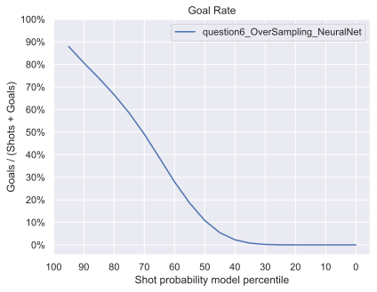</td>
    <td></td>   
  </tr>  
</table>
Le modèle perd en Accuracy, mais il prédit des buts! Les scores de Recall, f_score et AUC ont tous augmenté de façon considérable. Ce qui est encourageant.
On remarque que la courbe de calibration se détériore considérablement, nous tenterons de remédier à cela dans une expérience ultérieure.

### Réseaux neuronaux avec sous-échantillonnage
Ici, on retire assez de tirs pour avoir un nombre égal de tirs et de but. 

Modèle: [undersampling-neuralnet-model](https://www.comet.com/princesslove/model-registry/question6-undersampling-neuralnet-model)

Expérience: [undersampling-neuralnet-experience](https://www.comet.com/princesslove/itf-6758-team-4/2ebb21f1bc894143a0a237d4b873c77f?experiment-tab=chart&showOutliers=true&smoothing=0&transformY=smoothing&xAxis=wall)

<table>
 <tr>
    <th>Métrique</th>
    <th>Valeur</th>
  </tr>
  <tr>
    <td>Accuracy</td>
    <td>0.617</td>  
  </tr>
  <tr>
    <td>Precision</td>
    <td>0.541</td>   
  </tr>  
  <tr>
    <td>Recall</td>
    <td>0.618</td>   
  </tr>  
  <tr>
    <td>f score</td>
    <td>0.489</td>   
  </tr>  
  <tr>
    <td>AUC</td>
    <td>0.618</td>   
  </tr>  
</table>

<table>
  <tr>
    <td></td>
    <td></td>  
  </tr>
  <tr>
    <td></td>
    <td></td>   
  </tr>  
</table>
Le modèle ne prédit plus que des tirs, mais performe moins bien qu'avec le sur-échantillonnage, sûrement parce que l'on perd de l'information en retirant autant de tirs.
La technique de sur-échantillonnage semble, pour l'instant, la plus prometteuse.

### Réseaux neuronaux avec SMOTE
Ici, la méthode SMOTE permet de créer des nouveaux exemples de buts en créant de nouveaux points dans leur voisinage.

Modèle: [SMOTE-neuralnet-model](https://www.comet.com/princesslove/model-registry/question6-smote-neuralnet-model)

Expérience: [SMOTE-neuralnet-experience](https://www.comet.com/princesslove/itf-6758-team-4/b2410f1f88a747d9a0d2f08b4d266c40?experiment-tab=chart&showOutliers=true&smoothing=0&transformY=smoothing&xAxis=wall)

<table>
 <tr>
    <th>Métrique</th>
    <th>Valeur</th>
  </tr>
  <tr>
    <td>Accuracy</td>
    <td>0.747</td>  
  </tr>
  <tr>
    <td>Precision</td>
    <td>0.561</td>   
  </tr>  
  <tr>
    <td>Recall</td>
    <td>0.636</td>   
  </tr>  
  <tr>
    <td>f score</td>
    <td>0.558</td>   
  </tr>  
  <tr>
    <td>AUC</td>
    <td>0.636</td>   
  </tr>  
</table>

<table>
  <tr>
    <td></td>
    <td></td>  
  </tr>
  <tr>
    <td></td>
    <td></td>   
  </tr>  
</table>
Il s'agit de la meilleure technique d'échantillonnage testée. Elle permet de calibrer le modèle afin de prédire des buts, mais d'aussi conserver une Accuracy acceptable.
 
## Ajout des caractéristiques bonus de la supériorité numérique.

Pour cette étape nous ajoutons simplement les trois caractéristiques liées aux supériorités numériques.
Pour les expériences qui suivent nous utiliserons toujours la méthode d'échantillonnage SMOTE. 

### Réseaux neuronaux avec SMOTE et la supérioté numérique

Modèle: [SMOTE-Penalties-neuralnet-model](https://www.comet.com/princesslove/model-registry/question6-smote-with-penalties-neuralnet-model)

Expérience: [SMOTE-Penalties-neuralnet-experience](https://www.comet.com/princesslove/itf-6758-team-4/074a7a6225484f55b893922c16d200c0?experiment-tab=chart&showOutliers=true&smoothing=0&transformY=smoothing&xAxis=wall)

<table>
 <tr>
    <th>Métrique</th>
    <th>Valeur</th>
  </tr>
  <tr>
    <td>Accuracy</td>
    <td>0.762</td>  
  </tr>
  <tr>
    <td>Precision</td>
    <td>0.561</td>   
  </tr>  
  <tr>
    <td>Recall</td>
    <td>0.628</td>   
  </tr>  
  <tr>
    <td>f score</td>
    <td>0.562</td>   
  </tr>  
  <tr>
    <td>AUC</td>
    <td>0.628</td>   
  </tr>  
</table>

<table>
  <tr>
    <td></td>
    <td></td>  
  </tr>
  <tr>
    <td></td>
    <td></td>   
  </tr>  
</table>
On observe une amélioration de 2% de l'Accuracy, ainsi qu'une légère amélioration du f_score de 0.004. Prendre en compte les pénalités fonctionne!

## Calibration du seuil de prédiction

Puisque les données n'étaient pas balancées nous avons utilisé des méthodes d'échantillonnage. 
Cependant, il y a en général 10 fois moins de buts que de tirs ratés. Par conséquent, pour améliorer davantage les prédictions nous allons tenter de trouver le meilleur seuil de prédiction basé sur le f1_score.
Pour ce faire, nous testons simplement différents seuils et trouvons celui qui optimise la métrique f1_score. 
Cela a pour but de réduire le nombre de but prédit. 

 
### Réseaux neuronaux avec SMOTE, les supériorités numériques et la calibration du seuil

Le meilleur seuil de prédiction pour optimiser le f1_score a été trouvé à 0.8.

Modèle: [SMOTE-Penalties-Threshold-0.8-neuralnet-model](https://www.comet.com/princesslove/model-registry/question6-smote-with-penalties-t-0-8-neuralnet-model)

Expérience: [SMOTE-Penalties-Threshold-0.8-neuralnet-experience](https://www.comet.com/princesslove/itf-6758-team-4/c389af2961314320b5fa0bad84bdfc39?experiment-tab=chart&showOutliers=true&smoothing=0&transformY=smoothing&xAxis=wall)

<table>
 <tr>
    <th>Métrique</th>
    <th>Valeur</th>
  </tr>
  <tr>
    <td>Accuracy</td>
    <td>0.864</td>  
  </tr>
  <tr>
    <td>Precision</td>
    <td>0.59</td>   
  </tr>  
  <tr>
    <td>Recall</td>
    <td>0.583</td>   
  </tr>  
  <tr>
    <td>f score</td>
    <td>0.583</td>   
  </tr>  
  <tr>
    <td>AUC</td>
    <td>0.583</td>   
  </tr>  
</table>

<table>
  <tr>
    <td></td>
    <td></td>  
  </tr>
  <tr>
    <td></td>
    <td></td>   
  </tr>  
</table>
Il est à noter que la calibration ne transparaît pas sur la 'Calibration curve' puisque celle-ci prend en compte la probabilité.
C'est d'ailleurs parce que le modèle est si mal calibré pour faire face à la vraie distribution que nous avons décidé de tester plusieurs seuils différents. 


Matrices de confusion pour le seuil de base et le seuil optimal.

<table>
   <tr>
    <th>Seuil 0.5</th>
    <th>Seuil 0.8</th>
  </tr>  
  <tr>
    <td></td>
    <td></td>  
  </tr>
</table>

On gagne 10% d'Accuracy. L'effet recherché se perçoit dans les matrices de confusions, moins de but sont prédits.
Avant environ 18 500 tirs étaient prédit comme étant des buts, maintenant seulement environ 7 000. 

Il s'agit de notre meilleur modèle pour la partie 6. 

# 7. Évaluer sur l'ensemble de test 

## 7.1 La saison régulière
Voici les résultats sur la saison régulière de 2019-2020 pour les cinq modèles.
<table>
 <tr>
    <th>Modèle</th>
    <th>Accuracy</th>
    <th>Precision</th>
    <th>Recall</th>
    <th>f score</th>
    <th>AUC</th>
  </tr>
  <tr>
    <td>LR with distance</td>
    <td>0.902</td>
    <td>0.451</td>
    <td>0.500</td>
    <td>0.474</td>
    <td>0.500</td> 
  </tr>
  <tr>
    <td>LR with angle</td>
    <td>0.902</td>
    <td>0.451</td>
    <td>0.500</td>
    <td>0.474</td>
    <td>0.500</td> 
  </tr>  
  <tr>
    <td>LR with distance and angle</td>
    <td>0.902</td>
    <td>0.451</td>
    <td>0.500</td>
    <td>0.474</td>
    <td>0.500</td>    
  </tr>  
  <tr>
    <td>XGB</td>
    <td>0.858</td>
    <td>0.606</td>
    <td>0.615</td>
    <td>0.610</td>
    <td>0.615</td>   
  </tr>  
  <tr>
    <td>NN</td>
    <td>0.869</td>
    <td>0.599</td>
    <td>0.579</td>
    <td>0.587</td>
    <td>0.579</td>   
  </tr>  
</table>
<table>
  <tr>
    <td></td>
    <td></td>  
  </tr>
  <tr>
    <td></td>
    <td></td>   
  </tr>  
</table>

Puisque les classes sont très débalancées nous cherchons un modèle qui a un bon f_score et un bon Recall principalement.
Selon ces critères le meilleur modèle est le XGB, il a une Accuracy quelque peu plus basse que celle du réseau neuronal, mais différencie mieux les buts tout de même.

Les trois modèles de régression linéaire sont plutôt décevants, car ils retournent tous uniquement des tirs ratés et ne peuvent distinguer aucun but, peu utile dans notre cas.

On remarque aussi que le XGB et le réseau neuronal ont des résultats similaires à ceux obtenus sur l'ensemble de validation, ce qui signifie que les deux modèles généralisent bien sur la saison régulière.

## 7.2 La saison élimnatoire (Playoffs)
<table>
 <tr>
    <th>Modèle</th>
    <th>Accuracy</th>
    <th>Precision</th>
    <th>Recall</th>
    <th>f score</th>
    <th>AUC</th>
  </tr>
  <tr>
    <td>LR with distance</td>
    <td>0.909</td>
    <td>0.454</td>
    <td>0.500</td>
    <td>0.476</td>
    <td>0.500</td> 
  </tr>
  <tr>
    <td>LR with angle</td>
    <td>0.909</td>
    <td>0.454</td>
    <td>0.500</td>
    <td>0.476</td>
    <td>0.500</td> 
  </tr>  
  <tr>
    <td>LR with distance and angle</td>
    <td>0.909</td>
    <td>0.454</td>
    <td>0.500</td>
    <td>0.476</td>
    <td>0.500</td>    
  </tr>  
  <tr>
    <td>XGB</td>
    <td>0.843</td>
    <td>0.568</td>
    <td>0.582</td>
    <td>0.573</td>
    <td>0.580</td>   
  </tr>  
  <tr>
    <td>NN</td>
    <td>0.777</td>
    <td>0.520</td>
    <td>0.534</td>
    <td>0.517</td>
    <td>0.530</td>   
  </tr>  
</table>
<table>
  <tr>
  <td></td> 
    <td>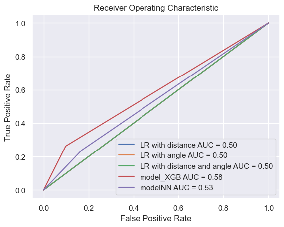</td>
     
  </tr>
  <tr>
    <td></td>
    <td>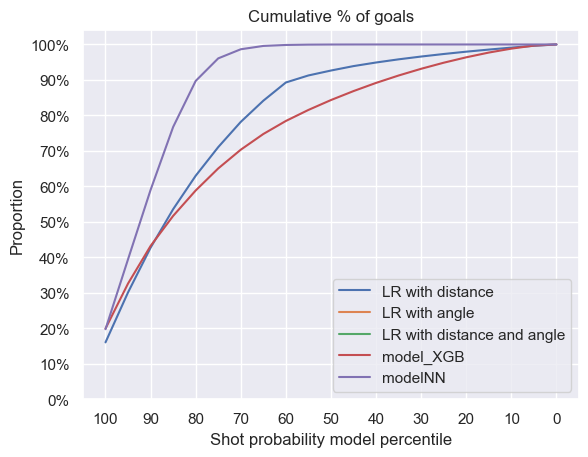</td>   
  </tr>  
</table>

***Commentaire :***

On observe que pour la régression logistique, les résultats sont toujours les mêmes. On s'y attend car le modèle ne prédit que des "Shots" et aucun "Goals". 

Pour les modèles de NN et de XGBoost on remarque qu'ils performent moins bien sur les playoffs. Notamment, le NN passe de 58,7% de f1 score sur la saison régulière à 51.7% de f1 score pour les playoffs. Le XGBoost est un peu plus robuste puisqu'on a un écart de 4% entre la saison régulière et les playoffs (61.0% pour la saison régulière et 57.3% pour les playoffs).

Cela se lit aussi sur les courbes Goal Rate, Cumulative %Goals et Calibration curves. Pour le XGboost ces courbes varient très peu entre les 2 saisons tandis que pour le NN les courbes ont beaucoup plus changé. Notamment sur la courbe du Goal Rate on peut voir que la pente est beaucoup plus raide, les probabilités sont toujours centrées plus ou moins autour de 0.8 mais avec un écart type beaucoup plus petit. Ce qui montre aussi que la confiance du modèle à distinguer les Shots des Goals est plus faible. Pour le NN, on aurait peut être besoin de définir un seuil différent pour la saison régulière et la saison des playoffs.

Cet écart de résultats entre les deux saisons peut être expliqué par la différence de style de jeu des joueurs et les stratégies que les équipes adoptent entre les playoffs et la saison régulière. 

En effet, premièrement, pendant les playoffs ce sont les meilleures équipes de la saison régulière qui jouent, donc les joueurs doivent constamment bien se situer sur la glace. Secondement, comme les meilleurs joueurs sont sur la glace, les tirs se finalisent moins fréquemment en buts. La proportion de but/tir pour la saison régulière est de 9,70% tandis que pour les playoffs celle-ci est de 9.09%. 

On peut voir notamment sur les matrices de confusion ci-dessous, que le NN prédit 17.4% des tirs comme des buts pour les playoffs et seulement 7,6% pour la saison régulière. Ajuster le seuil spécifiquement pour les playoffs pourrait donner de meilleurs résultats.

Nos modèles sur-apprennent les données de la saison régulière durant l'entrainement car il y en a plus et échouent à généraliser sur les données des playoffs. Finalement, en évaluant sur les deux ligues on observe que le NN et le XGB ne sont pas robustes sur les données du playoffs.

Stratifier les données en prenant en compte les saisons aurait pu aider.

<table>
  <tr>
      <th>Saison régulière</th>
      <th>Playoffs</th>
    </tr>
  <tr>
    <td>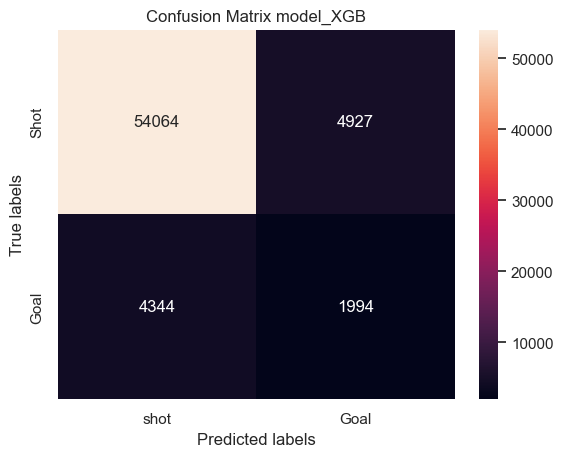</td>
    <td></td>
  </tr>
  <tr>
    <td>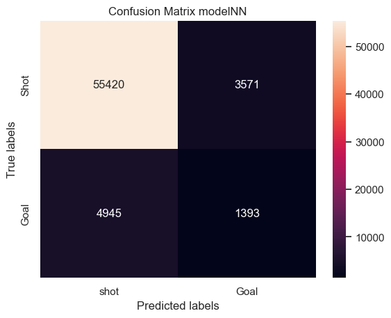
    </td>
    <td>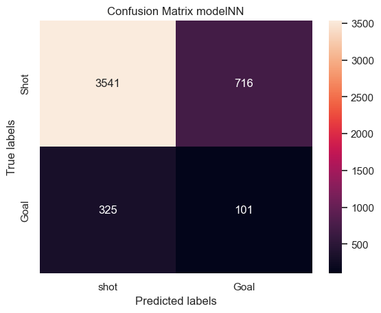
    </td>   
  </tr>  
</table>


En conclusion, le modèle XGBoost reste le meilleur modèle car il donne à la fois les meilleurs résultats durant l'entraînement mais également durant les tests que ce soit durant la saison régulière ou les playoffs. Toutefois, on note que les résultats sont moins bons pour les playoffs car le modèle sur-apprend les données de la saison régulière.


