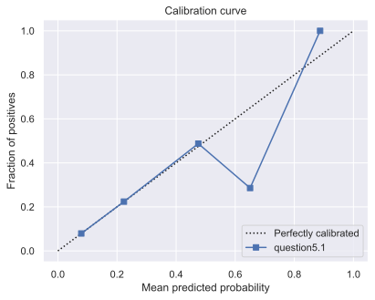
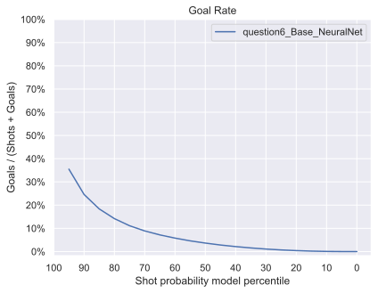
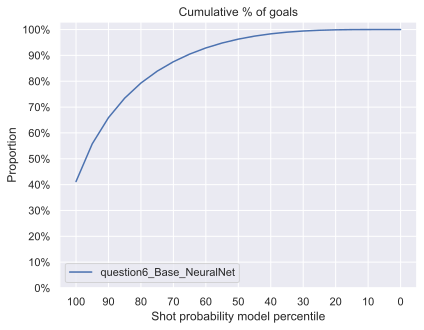

<h1>4. Ingénierie des caractéristiques II </h1>

<table>
  <tr>
    <th>Caractéristique</th>
    <th>Nom de la colonne</th>
    <th>Description</th>
  </tr>
  <tr>
    <td>Coordonnées</td>
    <td>x_coord et y_coord</td>
    <td>Coordonnées de l'événement</td>
  </tr>
  <tr>
    <td>Distance</td>
    <td>distance</td>
    <td>Distance entre le joueur et le but adverse</td>
  </tr>
  <tr>
    <td>Angle</td>
    <td>angle</td>
    <td>Angle entre le joueur et le but</td>
  </tr>
  <tr>
    <td>Type de tir</td>
    <td>shot_type</td>
    <td>Type du tir effectué (ex: Slap Shot)</td>
  </tr>
  <tr>
    <td>Filet désert</td>
    <td>empty_net</td>
    <td>Vrai si le filet est désert</td>
  </tr>
  <tr>
    <td>Dernier événement</td>
    <td>last_event_type</td>
    <td>Type du dernier événement (ex: Faceoff)</td>
  </tr>
  <tr>
    <td>Coordonnées du dernier événement</td>
    <td>last_x_coord et last_y_coord </td>
    <td>Coordonnées du dernier événement</td>
  </tr>
  <tr>
    <td>Distance avec le dernier événement</td>
    <td>distance_from_last</td>
    <td>Distance entre le tir et le dernier événement</td>
  </tr>
  <tr>
    <td>Temps depuis le dernier événement</td>
    <td>seconds_since_last</td>
    <td>Temps entre le tir et le dernier événement</td>
  </tr>
  <tr>
    <td>Rebon</td>
    <td>Rebound</td>
    <td>Vrai si le dernier événement était un tir</td>
  </tr>
  <tr>
    <td>Changement d'angle</td>
    <td>angle_change</td>
    <td>Différence d'angle entre ce tir et le tir précédent</td>
  </tr>
  <tr>
    <td>Vitesse</td>
    <td>speed</td>
    <td>Vitesse entre les deux événements</td>
  </tr>
  <tr>
    <td>Supériorité numérique</td>
    <td>powerplay</td>
    <td>Vrai, si l'équipe attaquante à plus de joueur sur la glace</td>
  </tr>
  <tr>
    <td>Nombre de joueur de l'équipe attaquante</td>
    <td>team_that_shot_nb</td>
    <td>Nombre de joueur de l'équipe attaquante</td>
  </tr>
  <tr>
    <td>Nombre de joueur de l'équipe défendante</td>
    <td>other_team_nb</td>
    <td>Nombre de joueur de l'équipe défendante</td>
  </tr>
</table>

<h1>5. Modèles avancés </h1>
<h1>5.1. XGboost avec comme features l'angle et la distance</h1>

L'expèrience comet associé à cette question peut être trouvé au lien suivant : 
[question 5.1](https://www.comet.com/princesslove/itf-6758-team-4/da3d1de95f164994a69ecd8be274747f?experiment-tab=chart&showOutliers=true&smoothing=0&transformY=smoothing&xAxis=wall)


<table>
 <tr>
    <th>Métrique</th>
    <th>Valeur</th>
  </tr>
  <tr>
    <td>Accuracy</td>
    <td>0.906</td>  
  </tr>
  <tr>
    <td>Precision</td>
    <td>0.697</td>   
  </tr>  
  <tr>
    <td>Recall</td>
    <td>0.501</td>   
  </tr>  
  <tr>
    <td>f score</td>
    <td>0.478</td>   
  </tr>  
  <tr>
    <td>AUC</td>
    <td>0.501</td>   
  </tr>  
</table>

<table>
  <tr>
    <td></td>
    <td></td>  
  </tr>
  <tr>
    <td></td>
    <td></td>   
  </tr>  
</table>

Commentaires : 
Pour toutes les expériences nous avons diviseé nos données d'entrainements en données d'entrainements et de validations. Cela nous permet de configurer nos modèles tout en évitant que ces paramétres ne soit pas que bon sur notre base de données.

Pour cette division nous avons défini unn seed commun à toutes les expériences pour pouvoir les comparer (seed fixé à 42) et on a également stratifié les données pour avoir la même répartition de label à "Goal" sur l'ensemble de données. En effet, les "Goals" étant minoritaires on veut qu'il y en ait assez dans l'ensemble d'entraiment pour que le modèle apprenne à les reconnaitre et on veut qu'il y en ait assez dans l'ensemble de validation pour avoir une évaluation pertinente.

Finalement on peut voir que juste avec ces 2 features (distance et angle) le XGBoost performe beaucoup meiux que la régression logistique puisqu'il parvient à prédire des Goals.

A COMPLETER PARLER DES GRAPHIQUES

<h1>5.2. XGboost paramétré avec toutes les features</h1>

L'expèrience comet associé à cette question peut être trouvé au lien suivant : 
[question 5.2](https://www.comet.com/princesslove/itf-6758-team-4/93f37095918649eea592e37100e8f278?experiment-tab=chart&showOutliers=true&smoothing=0&transformY=smoothing&xAxis=wall)

Commentaires :

Dans votre article de blog, discutez de votre configuration de réglage des hyperparamètres et incluez des figures pour justifier votre choix d'hyperparamètres. Par exemple, vous pouvez sélectionner les métriques appropriées et effectuer une recherche par grille avec validation croisée.

Pour le réglage d'hyperparamétres nous avons réalisé un random search de avec un stratified 5-fold cross validation et 100 combinaisons testées. En tout, cela revient a pris 30-40 minutes pour un total de 500 fits. Les paramétres testés sont les suivants :
```python
param_grid = {'gamma': [0,0.1,0.2,0.4,0.8,1.6,3.2,6.4,12.8,25.6],
              'learning_rate': [0.01, 0.1, 0.2, 0.3, 0.5],
              'scale_pos_weight' : [2,3,4,5,6,7],
              'max_depth': [5,6,7,8,9,10,11,12,13,14],
              'n_estimators': [50,65,80,100,115,130,150],
              'reg_alpha': [0,0.1,0.2,0.4,0.8,1.6,3.2,6.4,12.8,25.6,51.2,102.4,200],
              'reg_lambda': [0,0.1,0.2,0.4,0.8,1.6,3.2,6.4,12.8,25.6,51.2,102.4,200],
              'max_delta_step' : [1,2,3,4,5,6,7,8,9,10],
              'min_child_weight': [1, 5, 10],
              'subsample': [0.6, 0.8, 1.0],
              'colsample_bytree': [0.6, 0.8, 1.0],
              'lambda':[0.4, 0.6,0.8,1],
              'alpha':[0, 0.2,0.4,0.6],
            }

```
Notamment nous avons remarqué que le paramétre 'scale_pos_weight' étant très determinant dans les performances du modèles. En effet, il permet de gérer l'imbalancement des données.

avec 3 autres paramètres définis commut suit :
```python
model = XGBClassifier(objective='binary:logistic',
                        predictor='cpu_predictor',
                        tree_method = 'hist')
```

Nous avons défini la fonction objective comme celle par défaut pour une classification binaire, le paramétre predictor='cpu_predictor' permet un calcul plus rapide et de même pour tree_method = 'hist' qui permet de faire un binning jusqu'à un maximum de 255 bins sur les features continues.

<table>
 <tr>
    <th>Métrique</th>
    <th>Valeur</th>
  </tr>
  <tr>
    <td>Accuracy</td>
    <td>0.876</td>  
  </tr>
  <tr>
    <td>Precision</td>
    <td>0.631</td>   
  </tr>  
  <tr>
    <td>Recall</td>
    <td>0.626</td>   
  </tr>  
  <tr>
    <td>f score</td>
    <td>0.629</td>   
  </tr>  
  <tr>
    <td>AUC</td>
    <td>0.626</td>   
  </tr>  
</table>

<table>
  <tr>
    <td></td>
    <td></td>  
  </tr>
  <tr>
    <td></td>
    <td></td>   
  </tr>  
</table>


Commentaires : TODO
Une fois réglé, intégrez les courbes correspondant au meilleur modèle aux quatre figures de votre article de blog et comparez brièvement les résultats au baseline XGBoost de la premi`re partie. Incluez un lien vers l'entrée comet.ml appropriée pour cette expérience et enregistrez ce modèle dans le registre des modèles.

### 5.3. XGboost paramétré avec features selection

Pour cette partie on testé plusieurs techniques de sélection de features.

#### 5.3.1 Sélécetion avec Shap
Ensuite 

<table>
  <tr>
    <td></td>
    <td></td>  
  </tr>
</table>

#### 5.3.1 Suppression des redondances avec une HeatMap

Tout d'abord nous avons plot le heatmap des features pour observer et supprimer les redondances. Notamment, nous avons supprimé la feature 'last_event_type_Shot' qui est très fortement corrélé à "rebound". "rebound" étant plus corrélé à notre target "result_event" nous avons préféré le conserver.

<figure >
    
</figure>

#### 5.3.1 Séléction par Variance
After this first features séléction ofbased on the heatmap we tried different features séléction such as : 
- [VarianceThreshold](https://scikit-learn.org/stable/modules/generated/sklearn.feature_selection.VarianceThreshold.html) which is a selector that removes all low-variance features.
- Lasso that we computed using sklearn libraries [SelectModel](https://scikit-learn.org/stable/modules/generated/sklearn.feature_selection.SelectFromModel.html) and the model [LinearSVC](https://scikit-learn.org/stable/modules/generated/sklearn.svm.LinearSVC.html)

<table>
 <tr>
    <th>Métrique</th>
    <th>Valeur</th>
  </tr>
  <tr>
    <td>Accuracy</td>
    <td>0.635</td>  
  </tr>
  <tr>
    <td>Precision</td>
    <td>0.546</td>   
  </tr>  
  <tr>
    <td>Recall</td>
    <td>0.628</td>   
  </tr>  
  <tr>
    <td>f score</td>
    <td>0.5</td>   
  </tr>  
  <tr>
    <td>AUC</td>
    <td>0.628</td>   
  </tr>  
</table>

<table>
  <tr>
    <td></td>
    <td></td>  
  </tr>
  <tr>
    <td></td>
    <td></td>   
  </tr>  
</table>


<h1>6. Faites de votre mieux! </h1>

### 6.1 Réseaux neuronaux entrainés avec toutes les caractéristiques
<table>
 <tr>
    <th>Métrique</th>
    <th>Valeur</th>
  </tr>
  <tr>
    <td>Accuracy</td>
    <td>0.904</td>  
  </tr>
  <tr>
    <td>Precision</td>
    <td>0.68</td>   
  </tr>  
  <tr>
    <td>Recall</td>
    <td>0.54</td>   
  </tr>  
  <tr>
    <td>f score</td>
    <td>0.55</td>   
  </tr>  
  <tr>
    <td>AUC</td>
    <td>0.54</td>   
  </tr>  
</table>

<table>
  <tr>
    <td></td>
    <td></td>  
  </tr>
  <tr>
    <td></td>
    <td></td>   
  </tr>  
</table>

### 6.1 Réseaux neuronaux avec Over Sampling
<table>
 <tr>
    <th>Métrique</th>
    <th>Valeur</th>
  </tr>
  <tr>
    <td>Accuracy</td>
    <td>0.741</td>  
  </tr>
  <tr>
    <td>Precision</td>
    <td>0.613</td>   
  </tr>  
  <tr>
    <td>Recall</td>
    <td>0.795</td>   
  </tr>  
  <tr>
    <td>f score</td>
    <td>0.609</td>   
  </tr>  
  <tr>
    <td>AUC</td>
    <td>0.795</td>   
  </tr>  
</table>

<table>
  <tr>
    <td></td>
    <td></td>  
  </tr>
  <tr>
    <td></td>
    <td></td>   
  </tr>  
</table>


### 6.1 Réseaux neuronaux avec Under Sampling
<table>
 <tr>
    <th>Métrique</th>
    <th>Valeur</th>
  </tr>
  <tr>
    <td>Accuracy</td>
    <td>0.635</td>  
  </tr>
  <tr>
    <td>Precision</td>
    <td>0.546</td>   
  </tr>  
  <tr>
    <td>Recall</td>
    <td>0.628</td>   
  </tr>  
  <tr>
    <td>f score</td>
    <td>0.5</td>   
  </tr>  
  <tr>
    <td>AUC</td>
    <td>0.628</td>   
  </tr>  
</table>

<table>
  <tr>
    <td></td>
    <td></td>  
  </tr>
  <tr>
    <td></td>
    <td></td>   
  </tr>  
</table>


