<h1>5. Modèles avancés </h1>
<h1>5.1. XGboost avec comme features l'angle et la distance</h1>

Expérience: [question 5.1](https://www.comet.com/princesslove/itf-6758-team-4/da3d1de95f164994a69ecd8be274747f?experiment-tab=chart&showOutliers=true&smoothing=0&transformY=smoothing&xAxis=wall)


<table>
 <tr>
    <th>Métrique</th>
    <th>Valeur</th>
  </tr>
  <tr>
    <td>Accuracy</td>
    <td>0.906</td>  
  </tr>
  <tr>
    <td>Precision</td>
    <td>0.697</td>   
  </tr>  
  <tr>
    <td>Recall</td>
    <td>0.501</td>   
  </tr>  
  <tr>
    <td>f score</td>
    <td>0.478</td>   
  </tr>  
  <tr>
    <td>AUC</td>
    <td>0.501</td>   
  </tr>  
</table>

<table>
  <tr>
    <td>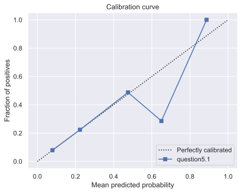</td>
    <td>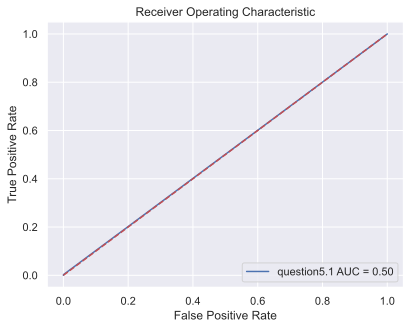</td>  
  </tr>
  <tr>
    <td>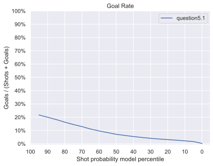</td>
    <td>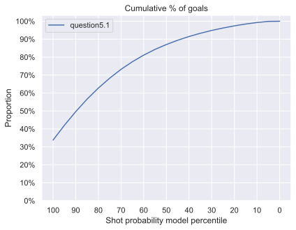</td>   
  </tr>  
</table>

Commentaires : Pour toutes les expériences nous avons divisé nos données d'entrainements en données d'entrainements et de validations. Cela nous permet de configurer nos modèles tout en nous laissant la possibilité de vérifier que ces paramètres se généralisent à de nouvelles données (ici nos données de test).

Pour cette division, nous avons défini un seed commun à toutes les expériences pour pouvoir les comparer (seed fixé à 42) et on a également stratifié les données pour avoir la même répartition de label à "Goal" sur l'ensemble de données. En effet, les "Goals" étant minoritaires on veut qu'il y en ait assez dans l'ensemble d'entraînement pour que le modèle apprenne à les reconnaître et, on veut qu'il y en ait assez dans l'ensemble de validation pour avoir une évaluation pertinente.

Finalement, on peut voir que, juste avec ces 2 features (distance et angle), le XGBoost performe mieux que la régression logistique puisqu'il parvient à prédire des buts ('Goals').

Les courbes de calibration montrent que le modèle XGboost est quasiment parfaitement calibré. Tandis que, que les régressions logistiques ne pouvaient pas être calibrées puisqu'ils ne prédisaient que des tirs (non-buts).


<h1>5.2. XGboost paramétré avec toutes les features</h1>

Modèle:[question 5.2](https://www.comet.com/princesslove/model-registry/question5-2-with-grid-search-json-model)

Expérience: [question 5.2](https://www.comet.com/princesslove/itf-6758-team-4/93f37095918649eea592e37100e8f278?experiment-tab=chart&showOutliers=true&smoothing=0&transformY=smoothing&xAxis=wall)

Commentaires :

Pour le réglage d'hyper paramètres nous avons réalisé un random search avec un stratified 5-fold cross validation et 100 combinaisons testées. En tout, cela a pris 30-40 minutes pour un total de 500 fits. Le f1 score macro a été utilisé comme métrique pour la sélection des meilleurs hyperparamètres. Les paramètres testés sont les suivants :


```python
param_grid = {'gamma': [0,0.1,0.2,0.4,0.8,1.6,3.2,6.4,12.8,25.6],
              'learning_rate': [0.01, 0.1, 0.2, 0.3, 0.5],
              'scale_pos_weight' : [2,3,4,5,6,7],
              'max_depth': [5,6,7,8,9,10,11,12,13,14],
              'n_estimators': [50,65,80,100,115,130,150],
              'reg_alpha': [0,0.1,0.2,0.4,0.8,1.6,3.2,6.4,12.8,25.6,51.2,102.4,200],
              'reg_lambda': [0,0.1,0.2,0.4,0.8,1.6,3.2,6.4,12.8,25.6,51.2,102.4,200],
              'max_delta_step' : [1,2,3,4,5,6,7,8,9,10],
              'min_child_weight': [1, 5, 10],
              'subsample': [0.6, 0.8, 1.0],
              'colsample_bytree': [0.6, 0.8, 1.0],
              'lambda':[0.4, 0.6,0.8,1],
              'alpha':[0, 0.2,0.4,0.6],
            }

```
Notamment nous avons remarqué que le paramètre 'scale_pos_weight' était très déterminant dans les performances du modèle. En effet, il permet de gérer le débalancement des données.

avec 3 autres paramètres définis comme suit :
```python
model = XGBClassifier(objective='binary:logistic',
                        predictor='cpu_predictor',
                        tree_method = 'hist')
```

Nous avons défini la fonction objective comme celle par défaut pour une classification binaire, le paramètre predictor='cpu_predictor' permet un calcul plus rapide et de même pour tree_method = 'hist' qui permet de faire un binning jusqu'à un maximum de 255 bins sur les features continues.

<table>
 <tr>
    <th>Métrique</th>
    <th>Valeur</th>
  </tr>
  <tr>
    <td>Accuracy</td>
    <td>0.876</td>  
  </tr>
  <tr>
    <td>Precision</td>
    <td>0.631</td>   
  </tr>  
  <tr>
    <td>Recall</td>
    <td>0.626</td>   
  </tr>  
  <tr>
    <td>f score</td>
    <td>0.629</td>   
  </tr>  
  <tr>
    <td>AUC</td>
    <td>0.626</td>   
  </tr>  
</table>

<table>
  <tr>
    <td></td>
    <td></td>  
  </tr>
  <tr>
    <td></td>
    <td></td>   
  </tr>  
</table>


***Commentaires :***

On observe que les résultats ont nettement augmenté. La courbe ROC n'est plus aligné à une droite linéaire équivalent à un modèle random. On passe de 0.501 à 0.626 de AUC. Cela vient principalement de l'argument 'scale_pos_weight' qui gére l'imbalencement des donnnées. En contre partie on a un modèle qui n'est pas calibré. Par conséquent, considérer que les probabilités en dessous de 0.5 sont des 'Shots' et ceux au dessus sont des 'Goals' n'est pas la solution optimale mais, reste une solution satisfaisante. C'est avec ce seuil de 0.5 que  nous avons calculé les autres métriques (accuracy, f1-score, presicion, recall et AUC).


NB : On pourrait calibrer le modèle avec la fonction [CalibratedClassifierCV](https://scikit-learn.org/stable/modules/generated/sklearn.calibration.CalibratedClassifierCV.html) de sklearn.


<h2>5.3. XGboost paramétré avec features selection</h2>

Pour cette partie on a testé plusieurs techniques de sélection de features.

<h3>5.3.1 Sélection avec Shap</h3>

Expérience: [XGBoost avec Shap](https://www.comet.com/princesslove/itf-6758-team-4/173fd21ad5824b2897a136f2598e84d0?experiment-tab=chart&showOutliers=true&smoothing=0&transformY=smoothing&xAxis=wall)

Tout d'abord nous avons évalué quelles features/caractéristiques étaient les plus importantes pour les prédictions du modèle XGBoost que nous avons paramétré plus tôt. Pour cela, nous avons utilisé la librairy [SHAP](https://github.com/slundberg/shap).

<table>
  <tr>
    <td>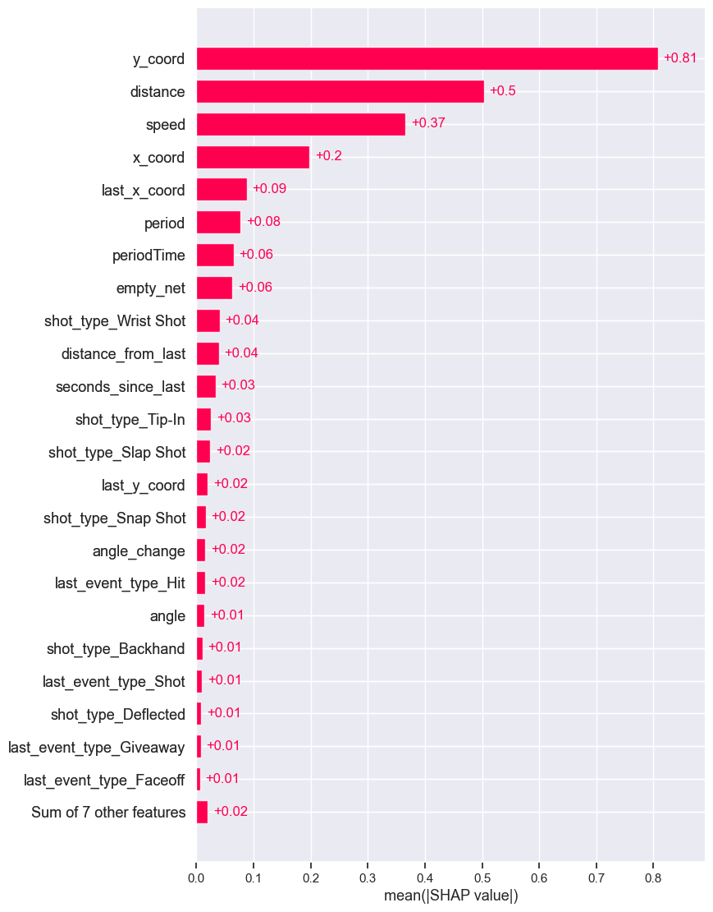</td>
    <td>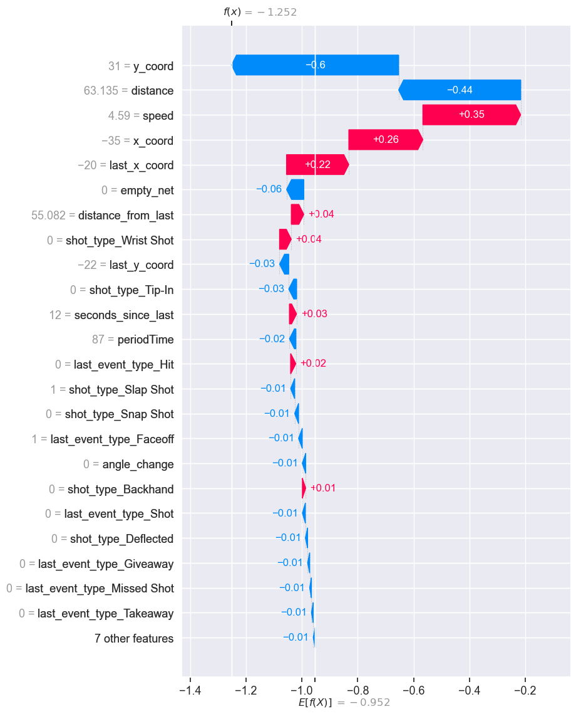</td>  
  </tr>
</table>

Après avoir visualisé les features qui aident le plus notre modèle, on a décidé de ne sélectionner que les features donnant un score shape supéreieur à 0.02 (en valeur absolue).

<h3>5.3.2 Suppression des redondances avec une HeatMap</h3>

Tout d'abord nous avons plot le heatmap des features pour observer et supprimer les redondances. Notamment, nous avons supprimé la feature 'last_event_type_Shot' qui est très fortement corrélé à "rebound". "rebound" étant plus corrélé à notre target "result_event" nous avons préféré le conserver.

<figure >
    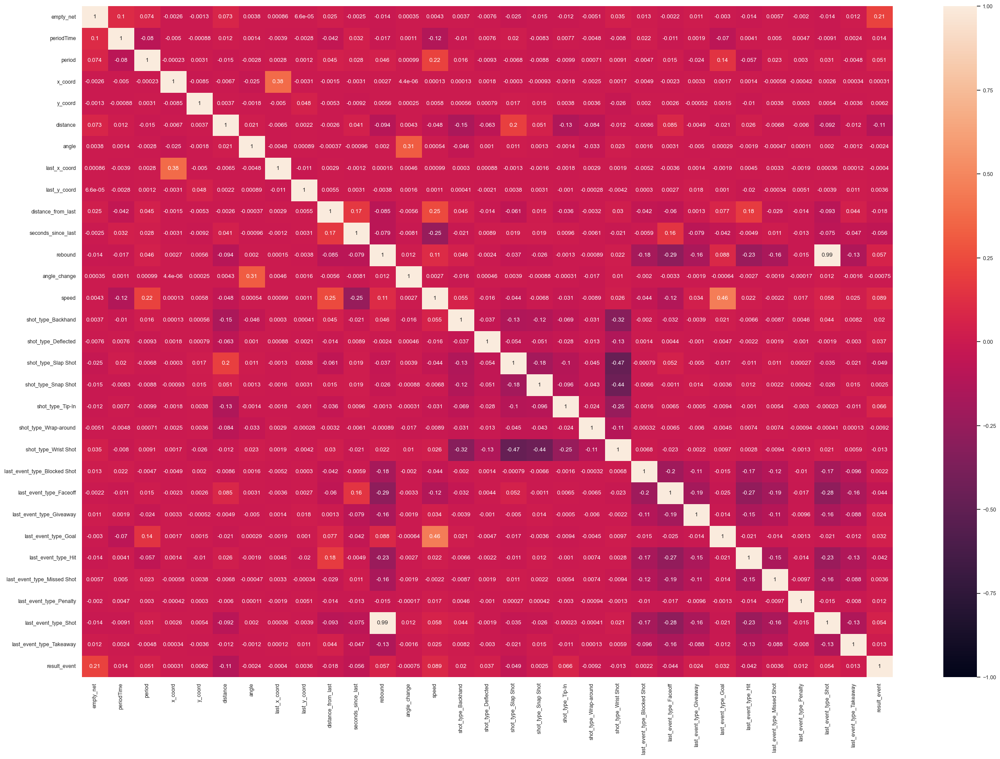
</figure>


Aprés cette première selection de features basé sur le heatmap nous avons testé différentes sélections de features. ***Pour chacune d'entre elles nous avons supprimé au préalable la redondance 'last_event_type_Shot'***.
<h3> 5.3.3 Sélection de features basé sur la variance </h3>

Expérience: [XGBoost avec Variance](https://www.comet.com/princesslove/itf-6758-team-4/c1fb955779bb423fa09e199aa81eb884?experiment-tab=chart&showOutliers=true&smoothing=0&transformY=smoothing&xAxis=wall)

[VarianceThreshold](https://scikit-learn.org/stable/modules/generated/sklearn.feature_selection.VarianceThreshold.html) qui permet de supprimer toutes les features à faible variance.
  
```python 
selector = VarianceThreshold(threshold=0.95)
```

Cette méthode conserve toutes les features dans notre cas.

<h3> 5.3.4 Sélection de features basé sur le LASSO</h3>

Expérience: [XGBoost avec Lasso](https://www.comet.com/princesslove/itf-6758-team-4/7e5f4b37f13740b484415676a5b7f507?experiment-tab=chart&showOutliers=true&smoothing=0&transformY=smoothing&xAxis=wall)


Lasso that we computed using sklearn libraries [SelectModel](https://scikit-learn.org/stable/modules/generated/sklearn.feature_selection.SelectFromModel.html) and the model [LinearSVC](https://scikit-learn.org/stable/modules/generated/sklearn.svm.LinearSVC.html)

Voici comment nous avons réalisé le LASSO : 

```python
xgb_lasso = Pipeline([
  ('feature_selection', SelectFromModel(LinearSVC(C=0.001, penalty="l1", dual=False))),
  ('classification', XGBClassifier(scale_pos_weight = 4))
])
```

Le lasso supprime de sa sélection les features : 'periodTime','x_coord', 'angle','last_x_coord', 'last_y_coord', 'angle_change' 'shot_type_Backhand','shot_type_Slap Shot', 'last_event_type_Blocked Shot', 'last_event_type_Missed Shot',

<h3>5.3.5 Sélection de features basé sur le Sequential forward/backward</h3>

On a pensé et essayé d'appliquer cette méthode mais elle est très couteuse en temps et nous avons donc abandonné l'idée.

<h3>5.3.6 Sélection de features basé une métrique</h3>

Expérience: [XGBoost avec fKBest](https://www.comet.com/princesslove/itf-6758-team-4/e167b9f118394c85a661d47d3c5b4b64?experiment-tab=chart&showOutliers=true&smoothing=0&transformY=smoothing&xAxis=wall)


L'idée est de séléctionner les k best features en se basant sur la métirque [f_classif](https://scikit-learn.org/stable/modules/generated/sklearn.feature_selection.f_classif.html#sklearn.feature_selection.f_classif).

Pour choisir le nombre k de features optimales nous les avons toutes testés en les évaluant sur 4 métriques (Accuracy, f1 score, precision et recall).


<figure >
    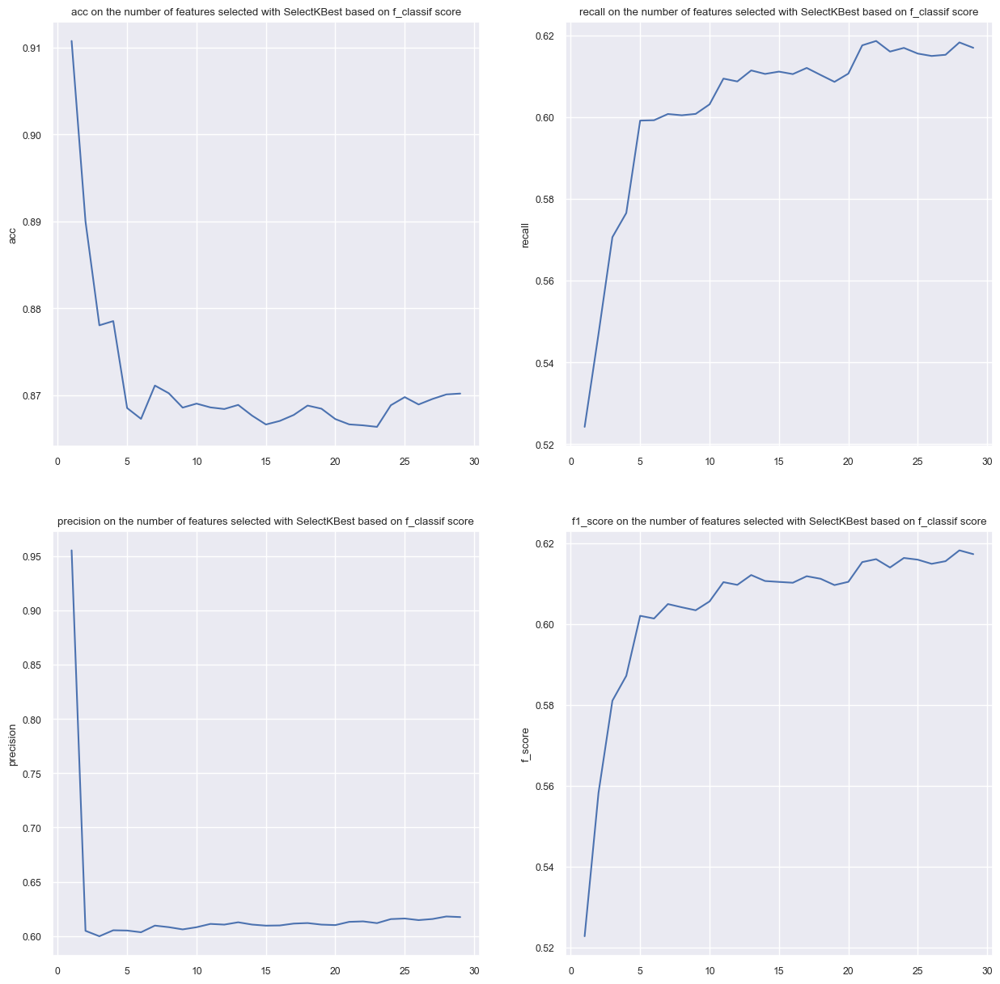
</figure>

Finalement c'est pour k=28 que les meilleurs résultats sont obtenus.
***La méthode des k best exclus la feature 'x_coord' de sa séléction.***

<h3> 5.3.7 Comparaison des méthodes de séléctions</h3>

Finalement, nous avons comparé toutes ces séléctions entre elles en utilisant le même paramétrage de modèle XGBoost suivant :

```python
 model = XGBClassifier(scale_pos_weight = 4)
```
Ce choix de paramétrage a été fait pour atténuer le débalancement des données. Suite à cette comparaison nous avons conclus que la meilleure sélection était tout simplement de prendre toutes les features sauf les redondantes, c'est à dire le 'last_event_type_Shot' dans notre cas.

Voici les figures comparant les résultats des séléctions de features.

<table>
  <tr>
  <td>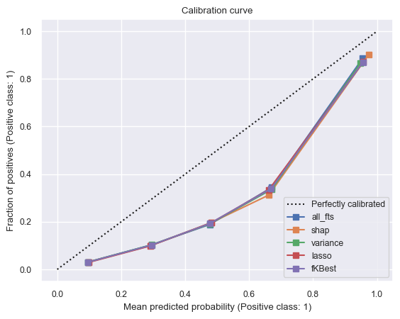</td>
  <td>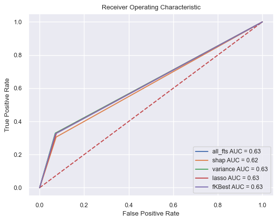</td>  
  </tr>
  <tr>
    <td></td>
    <td>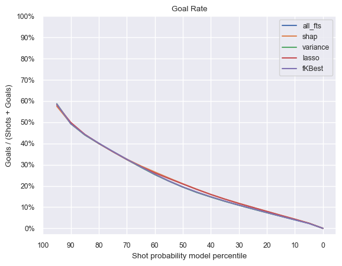</td>   
  </tr>  
</table>


Tableau présentant les résultats des différentes sélèctions de caractériques selon différentes métriques.
<figure >
    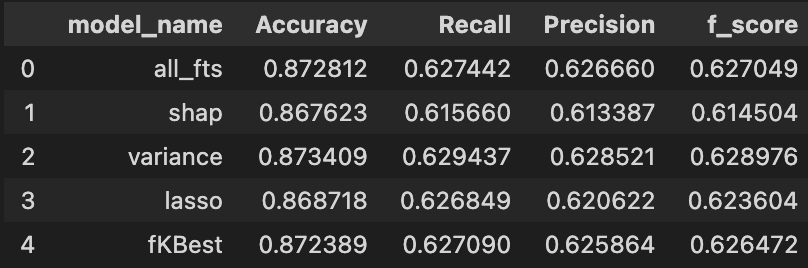
</figure>

NB:
- all_fts : toutes les features/caractéristiques sans exception (même les redondantes). (Experience : [XGBoost avec toutes les features](https://www.comet.com/princesslove/itf-6758-team-4/5a2d2a2cc121456389eecf91a5601723?experiment-tab=chart&showOutliers=true&smoothing=0&transformY=smoothing&xAxis=wall)
- shap :  les features/caractéristiques selectionnées par analyse des SHAP values et avec suppression de redondances.
- variance : features/caractéristiques selectionnées avec la méthode de la variance (après suppression de redondances). Dans notre cas, cela revient à considérer toutes les features sauf les redondantes, car la méthode de la variance ne fait aucune sélection.
- lasso : features/caractéristiques selectionnées avec la méthode LASSO (après suppression de redondances).
- fKBest : les 28 meilleurs features/caractéristiques en se basant sur le f_classif score (après suppression de redondances).


On observe que les résultats entre toutes ces seléctions sont assez similaire. La séléction avec les valeurs Shap était peut être un peu brutal, il aurait fallut considérer un plus grand nombre de features peut être dans ce cas.

<h3> 5.3.8 Grid Search avec les meilleurs features/caractéristiques sélectionnées </h3>

Modèle:[question 5.3](https://www.comet.com/princesslove/model-registry/question5-3-grid-search-fts-selected-model)

Expérience: [question 5.3](https://www.comet.com/princesslove/itf-6758-team-4/38505bd6308c472084e1f4d53f7d650a?experiment-tab=chart&showOutliers=true&smoothing=0&transformY=smoothing&xAxis=wall)

<table>
 <tr>
    <th>Métrique</th>
    <th>Valeur</th>
  </tr>
  <tr>
    <td>Accuracy</td>
    <td>0.875</td>  
  </tr>
  <tr>
    <td>Precision</td>
    <td>0.632</td>   
  </tr>  
  <tr>
    <td>Recall</td>
    <td>0.631</td>   
  </tr>  
  <tr>
    <td>f score</td>
    <td>0.631</td>   
  </tr>  
  <tr>
    <td>AUC</td>
    <td>0.631</td>   
  </tr>  
</table>

<table>
  <tr>
  <td></td>  
    <td></td>
    
  </tr>
  <tr>
    <td></td>
    <td></td>   
  </tr>  
</table>


Commentaire :

Les résultats au niveau des courbes n'ont pas vraiment évolué et, cela parce que nous n'avons que supprimé une feature/caractéristique parmi toutes les autres. Toutefois, les résultats ont augmenté puisqu'on passe de 62.6% de AUC à 63.1% de AUC.

NB: à noter que toutes les combinaisons des paramétres n'ont pas été testé, car on a réalisé un RandomSearch. Par conséquent une part de l'écart entre ces résultats peut provenir d'un meilleur paramétrage.


## 7.2 La saison élimnatoire (Playoffs)
<table>
 <tr>
    <th>Modèle</th>
    <th>Accuracy</th>
    <th>Precision</th>
    <th>Recall</th>
    <th>f score</th>
    <th>AUC</th>
  </tr>
  <tr>
    <td>LR with distance</td>
    <td>0.909</td>
    <td>0.454</td>
    <td>0.500</td>
    <td>0.476</td>
    <td>0.500</td> 
  </tr>
  <tr>
    <td>LR with angle</td>
    <td>0.909</td>
    <td>0.454</td>
    <td>0.500</td>
    <td>0.476</td>
    <td>0.500</td> 
  </tr>  
  <tr>
    <td>LR with distance and angle</td>
    <td>0.909</td>
    <td>0.454</td>
    <td>0.500</td>
    <td>0.476</td>
    <td>0.500</td>    
  </tr>  
  <tr>
    <td>XGB</td>
    <td>0.843</td>
    <td>0.568</td>
    <td>0.582</td>
    <td>0.573</td>
    <td>0.580</td>   
  </tr>  
  <tr>
    <td>NN</td>
    <td>0.777</td>
    <td>0.520</td>
    <td>0.534</td>
    <td>0.517</td>
    <td>0.530</td>   
  </tr>  
</table>
<table>
  <tr>
  <td>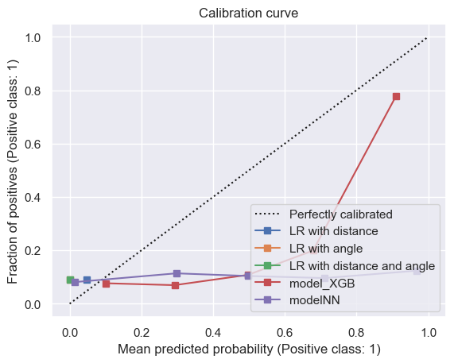</td> 
    <td>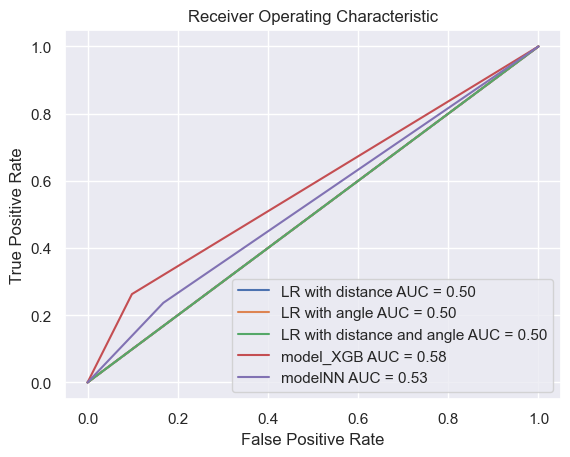</td>
     
  </tr>
  <tr>
    <td>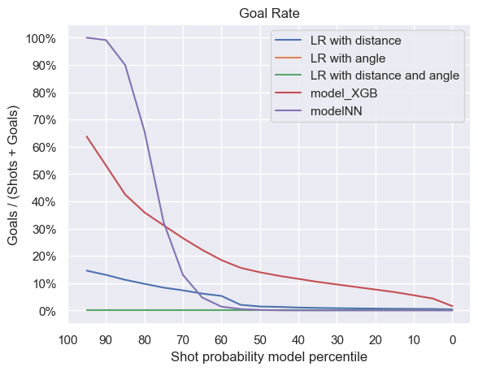</td>
    <td>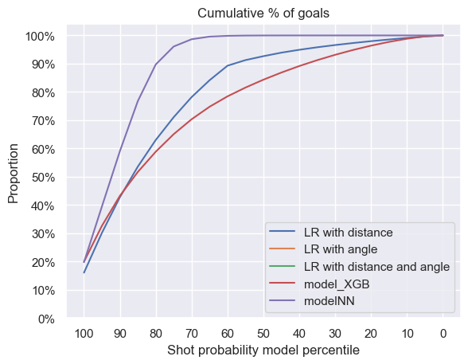</td>   
  </tr>  
</table>

***Commentaire :***

On observe que pour la régression logistique, les résultats sont toujours les mêmes. On s'y attend car le modèle ne prédit que des "Shots" et aucun "Goals". 

Pour les modèles de NN et de XGBoost on remarque qu'ils performent moins bien sur les playoffs. Notamment, le NN passe de 58,7% de f1 score sur la saison régulière à 51.7% de f1 score pour les playoffs. Le XGBoost est un peu plus robuste puisque qu'on a un écart de 4% entre la saison régulière et les playoffs (61.0% pour la saison réguliére et 57.3% pour les playoffs).

Cela se lit aussi sur les courbes Goal Rate, Cumulative %Goals et Calibration curves. Pour le XGboost ces courbes varient très peu entre les 2 saisons tandis que pour le NN les courbes ont beacoup plus changé. Notamment sur la courbe du Goal Rate on peut voir que la pente est beaucoup plus raide, les probabilités sont toujours centré plus ou moins autour de 0.8 mais avec un écart type beaucoup plus petit. Ce qui montre aussi que la confiance du modèle à distinguer les Shots des Goals est plus faible. Pour le NN, on aurait peut être besoin de définir un seuil différent pour la saison régulière et la saison des playoffs.

Cet écart de résultats entre les deux saisons peut être expliqué par la différence de style de jeu des joueurs et les stratégies que les équipes adoptent entre les playoffs et la saison régulière. 

En effet, premièrement, pendant les playoffs ce sont les meilleures équipes de la saison régulière qui jouent, donc les joueurs doivent constamment bien se situer sur la glace. Secondement, comme les meilleurs joueurs sont sur la glace, les tirs se finalisent moins fréquemment en buts. La proportion de but/tir pour la saison régulière est de 9,70% tandis que pour les playoffs celle-ci est de 9.09%. 

On peut voir notamment sur les matrices de confusion ci-dessous, que le NN prédit 17.4% des tirs comme des buts pour les playoffs et seulement 7,6% pour la saison régulière. Ajuster le seuil spécifiquement pour les playoffs pourrait donner de meilleurs résultats.

Nos modèles surraprennent les données de la saison régulière durant l'entrainement car il y en a plus et échoue à généraliser sur les données des playoffs. Finalement, en évaluant sur les deux ligues on observe que le NN et le XGB ne sont pas robustes sur les données du playoffs.

Stratifier les données en prenant en compte les saisons aurait pu aider.

<table>
  <tr>
      <th>Saison régulière</th>
      <th>Playoffs</th>
    </tr>
  <tr>
    <td>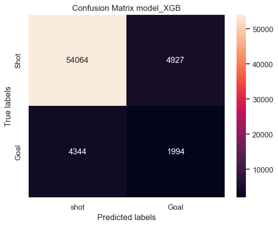</td>
    <td>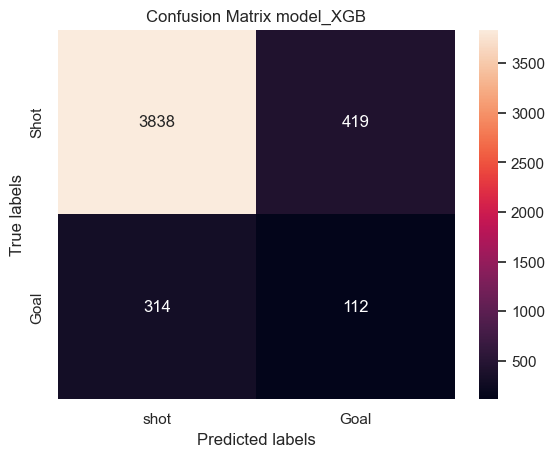</td>
  </tr>
  <tr>
    <td>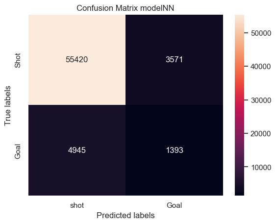
    </td>
    <td>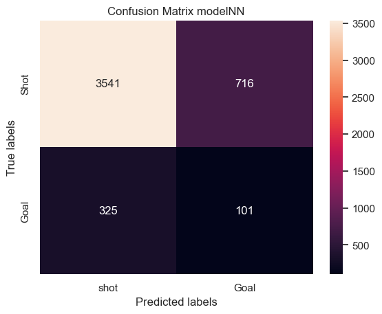
    </td>   
  </tr>  
</table>


En conclusion, le modèle XGBoost reste le meilleur modèle car il donne à la fois les meilleurs résultats durant l'entrainement mais également durant les tests que ce soit durant la saison régulière ou les playoffs. Toutefois, on note que les résultats sont moins bon pour les playoffs car le modèle surapprend les données de la saison régulière.
