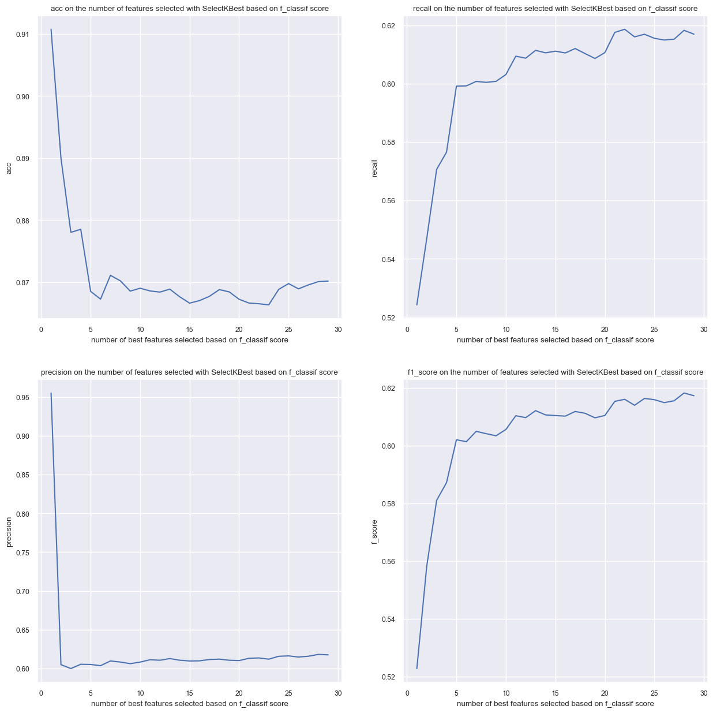

<h1>5. Modèles avancés </h1>
<h1>5.1. XGboost avec comme features l'angle et la distance</h1>

L'expèrience comet associé à cette question peut être trouvé au lien suivant : 
[question 5.1](https://www.comet.com/princesslove/itf-6758-team-4/da3d1de95f164994a69ecd8be274747f?experiment-tab=chart&showOutliers=true&smoothing=0&transformY=smoothing&xAxis=wall)


<table>
 <tr>
    <th>Métrique</th>
    <th>Valeur</th>
  </tr>
  <tr>
    <td>Accuracy</td>
    <td>0.906</td>  
  </tr>
  <tr>
    <td>Precision</td>
    <td>0.697</td>   
  </tr>  
  <tr>
    <td>Recall</td>
    <td>0.501</td>   
  </tr>  
  <tr>
    <td>f score</td>
    <td>0.478</td>   
  </tr>  
  <tr>
    <td>AUC</td>
    <td>0.501</td>   
  </tr>  
</table>

<table>
  <tr>
    <td></td>
    <td></td>  
  </tr>
  <tr>
    <td></td>
    <td></td>   
  </tr>  
</table>

Commentaires : 
Pour toutes les expériences nous avons diviseé nos données d'entrainements en données d'entrainements et de validations. Cela nous permet de configurer nos modèles tout en évitant que ces paramétres ne soit pas que bon sur notre base de données.

Pour cette division nous avons défini unn seed commun à toutes les expériences pour pouvoir les comparer (seed fixé à 42) et on a également stratifié les données pour avoir la même répartition de label à "Goal" sur l'ensemble de données. En effet, les "Goals" étant minoritaires on veut qu'il y en ait assez dans l'ensemble d'entraiment pour que le modèle apprenne à les reconnaitre et on veut qu'il y en ait assez dans l'ensemble de validation pour avoir une évaluation pertinente.

Finalement on peut voir que juste avec ces 2 features (distance et angle) le XGBoost performe beaucoup meiux que la régression logistique puisqu'il parvient à prédire des Goals.

A COMPLETER PARLER DES GRAPHIQUES

<h1>5.2. XGboost paramétré avec toutes les features</h1>

L'expèrience comet associé à cette question peut être trouvé au lien suivant : 
[question 5.2](https://www.comet.com/princesslove/itf-6758-team-4/93f37095918649eea592e37100e8f278?experiment-tab=chart&showOutliers=true&smoothing=0&transformY=smoothing&xAxis=wall)

Commentaires :

Dans votre article de blog, discutez de votre configuration de réglage des hyperparamètres et incluez des figures pour justifier votre choix d'hyperparamètres. Par exemple, vous pouvez sélectionner les métriques appropriées et effectuer une recherche par grille avec validation croisée.

Pour le réglage d'hyperparamétres nous avons réalisé un random search de avec un stratified 5-fold cross validation et 100 combinaisons testées. En tout, cela revient a pris 30-40 minutes pour un total de 500 fits. Les paramétres testés sont les suivants :
```python
param_grid = {'gamma': [0,0.1,0.2,0.4,0.8,1.6,3.2,6.4,12.8,25.6],
              'learning_rate': [0.01, 0.1, 0.2, 0.3, 0.5],
              'scale_pos_weight' : [2,3,4,5,6,7],
              'max_depth': [5,6,7,8,9,10,11,12,13,14],
              'n_estimators': [50,65,80,100,115,130,150],
              'reg_alpha': [0,0.1,0.2,0.4,0.8,1.6,3.2,6.4,12.8,25.6,51.2,102.4,200],
              'reg_lambda': [0,0.1,0.2,0.4,0.8,1.6,3.2,6.4,12.8,25.6,51.2,102.4,200],
              'max_delta_step' : [1,2,3,4,5,6,7,8,9,10],
              'min_child_weight': [1, 5, 10],
              'subsample': [0.6, 0.8, 1.0],
              'colsample_bytree': [0.6, 0.8, 1.0],
              'lambda':[0.4, 0.6,0.8,1],
              'alpha':[0, 0.2,0.4,0.6],
            }

```
Notamment nous avons remarqué que le paramétre 'scale_pos_weight' étant très determinant dans les performances du modèles. En effet, il permet de gérer l'imbalancement des données.

avec 3 autres paramètres définis commut suit :
```python
model = XGBClassifier(objective='binary:logistic',
                        predictor='cpu_predictor',
                        tree_method = 'hist')
```

Nous avons défini la fonction objective comme celle par défaut pour une classification binaire, le paramétre predictor='cpu_predictor' permet un calcul plus rapide et de même pour tree_method = 'hist' qui permet de faire un binning jusqu'à un maximum de 255 bins sur les features continues.

<table>
 <tr>
    <th>Métrique</th>
    <th>Valeur</th>
  </tr>
  <tr>
    <td>Accuracy</td>
    <td>0.876</td>  
  </tr>
  <tr>
    <td>Precision</td>
    <td>0.631</td>   
  </tr>  
  <tr>
    <td>Recall</td>
    <td>0.626</td>   
  </tr>  
  <tr>
    <td>f score</td>
    <td>0.629</td>   
  </tr>  
  <tr>
    <td>AUC</td>
    <td>0.626</td>   
  </tr>  
</table>

<table>
  <tr>
    <td></td>
    <td></td>  
  </tr>
  <tr>
    <td></td>
    <td></td>   
  </tr>  
</table>


Commentaires : TODO
Une fois réglé, intégrez les courbes correspondant au meilleur modèle aux quatre figures de votre article de blog et comparez brièvement les résultats au baseline XGBoost de la premi`re partie. Incluez un lien vers l'entrée comet.ml appropriée pour cette expérience et enregistrez ce modèle dans le registre des modèles.

<h2>5.3. XGboost paramétré avec features selection</h2>

Pour cette partie on a testé plusieurs techniques de sélection de features.

<h3>5.3.1 Sélection avec Shap</h3>

Tout d'abord nous avons évaluer quelles features étaient les plus importantes pour les prédictions du modèle XGBoost que nous avons paramétré plutôt. Pourr cela nous avons utilisé la librairy [SHAP](https://github.com/slundberg/shap).

<table>
  <tr>
    <td></td>
    <td></td>  
  </tr>
</table>

Après avoir visualisé les features qui aident le plus notre modèle à prédire ce qu'on veut, on a décidé de ne sélectionner que les features donnant un score shape supéreieur à 0.02 (en valeur absolu).

<h3>5.3.2 Suppression des redondances avec une HeatMap</h3>

Tout d'abord nous avons plot le heatmap des features pour observer et supprimer les redondances. Notamment, nous avons supprimé la feature 'last_event_type_Shot' qui est très fortement corrélé à "rebound". "rebound" étant plus corrélé à notre target "result_event" nous avons préféré le conserver.

<figure >
    
</figure>


Aprés cette première selection de features basé sur le heatmap nous avons testé différentes séléction de features. ***Pour chacune d'entre elles nous avons supprimé au préalable la redondance 'last_event_type_Shot'***.
<h3> 5.3.3 Sélection de features basé sur la variance </h3>

[VarianceThreshold](https://scikit-learn.org/stable/modules/generated/sklearn.feature_selection.VarianceThreshold.html) qui est un selecteur qui supprime toutes les features à faible variance.
  
```python 
selector = VarianceThreshold(threshold=0.95)
```

Cette méthode consevre toutes les features.

<h3> 5.3.4 Sélection de features basé sur le LASSO</h3>
Lasso that we computed using sklearn libraries [SelectModel](https://scikit-learn.org/stable/modules/generated/sklearn.feature_selection.SelectFromModel.html) and the model [LinearSVC](https://scikit-learn.org/stable/modules/generated/sklearn.svm.LinearSVC.html)

Voici comment nous avons réalisé le LASSO : 

```python
xgb_lasso = Pipeline([
  ('feature_selection', SelectFromModel(LinearSVC(C=0.001, penalty="l1", dual=False))),
  ('classification', XGBClassifier(scale_pos_weight = 4))
])
```

Le lasso supprimer de sa sélection les features : 'periodTime','x_coord', 'angle','last_x_coord', 'last_y_coord', 'angle_change' 'shot_type_Backhand','shot_type_Slap Shot', 'last_event_type_Blocked Shot', 'last_event_type_Missed Shot',

<h3>5.3.5 Sélection de features basé sur le Seqential forward/backward</h3>

On a pensé et essayer d'appliquer cette méthode mais elle est très couteuses en temps et nous avons donc abandonné l'idée.

<h3>5.3.6 Sélection de features basé une métrique</h3>
L'idée est de séléctionner les k best features en se basant sur la métirque [f_classif](https://scikit-learn.org/stable/modules/generated/sklearn.feature_selection.f_classif.html#sklearn.feature_selection.f_classif).

Pour choisir le nombre k de features optimales nous les avons toutes testés en les évaluant sur 4 métriques (Accuracy, f1 score, precision et recall).


<figure >
    
</figure>

Finalement c'est pour k=28 que les meilleurs résultats sont obtenus.
***La méthode des k best exclus la feature 'x_coord' de sa séléction.***

<h3> 5.3.7 Comparaison des méthodes de séléctions</h3>

Finalement, nous avons comparé toutes ces séléctions entre elles en utilisant le même paramétrage de modèle XGBoost suivant :

```python
 model = XGBClassifier(scale_pos_weight = 4)
```
Ce choix de paramétrage a été fait pour attenuer l'imbalancement des données. Suite à cette comparaison nous avons conclus que la meilleur sélection était tout simplement de prendre toutes les features sauf les redondantes, c'est à dire le 'last_event_type_Shot' dans notre cas.

Voici les figures comparant les résultats des séléctions de features.

<table>
  <tr>
    <td></td>
    <td></td>  
  </tr>
  <tr>
    <td></td>
    <td></td>   
  </tr>  
</table>


<figure >
    
</figure>

NB:
- all_fts : toutes les features sans exception (même les redondantes).
- shap :  les features selectionnées par analyse des SHAP values et avec suppression de redondances.
- variance : features selectionnées avec la méthode des variance (après suppression de redondances). Dans notre cas cela revient à considéré toutes les features sauf les redondantes, cas la méthode de la variance ne fait aucune sélection.
- lasso : features selectionnées avec la méthode LASSO (après suppression de redondances).
- fKBest : les 28 meilleurs features basé sur le f_classif score (après suppression de redondances).


On observe que les résultats entre toutes ces séléctions sont assez similaire. La séléction avec les valeurs Shap était peut être un peu brutal, il aurait fallut considérer un plus grand nombre de features peut être dans ce cas.

<h3> 5.3.8 Grid Search avec les meilleurs features selectionnés </h3>

L'expèrience comet associé à cette question peut être trouvé au lien suivant : 
[question 5.3](https://www.comet.com/princesslove/itf-6758-team-4/38505bd6308c472084e1f4d53f7d650a?experiment-tab=chart&showOutliers=true&smoothing=0&transformY=smoothing&xAxis=wall)

<table>
 <tr>
    <th>Métrique</th>
    <th>Valeur</th>
  </tr>
  <tr>
    <td>Accuracy</td>
    <td>0.875</td>  
  </tr>
  <tr>
    <td>Precision</td>
    <td>0.632</td>   
  </tr>  
  <tr>
    <td>Recall</td>
    <td>0.631</td>   
  </tr>  
  <tr>
    <td>f score</td>
    <td>0.631</td>   
  </tr>  
  <tr>
    <td>AUC</td>
    <td>0.631</td>   
  </tr>  
</table>

<table>
  <tr>
    <td></td>
    <td></td>  
  </tr>
  <tr>
    <td></td>
    <td></td>   
  </tr>  
</table>


Commentaire :

TODO comparer aux autres résultats rapidement