<h1> 2. Ingénierie des caractéristiques I </h1>

### 2.1 

<figure>
    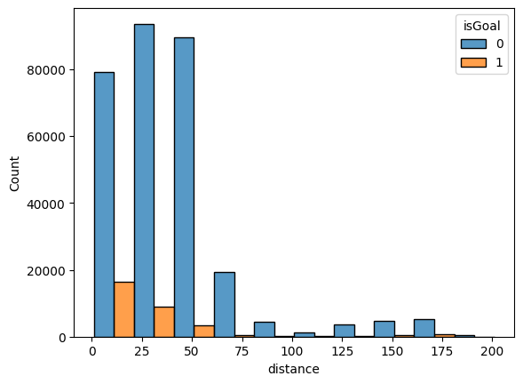
</figure>

Cette figure représente un histogramme du nombre de tirs séparés en buts et non-buts, regroupés par distance. La figure nous montre qu'il y a un plus grand nombre de buts pour pour les distances courtes. C'est également le cas pour le nombre de non-buts, qui sont plus élevés pour les distances courtes. De manière générale, nos données nous indiquent que plus on est proche du filet, plus le nombre de tirs (buts et non-buts) est élevé. 

<figure>
    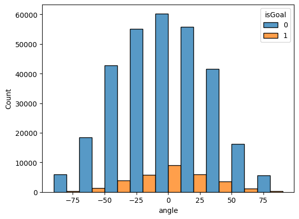
</figure>

Cette figure représente un histogramme du nombre de tirs séparés en buts et non-buts regroupés par angle. En observant notre histogramme, nous remarquons que le plus grand nombre de buts se trouve dans un intervalle d'angle de tir assez faible. Dans notre cas, 0° semble être le meilleur angle de tir pour avoir un but. En effet, les joueurs qui tirent plus ou moins droit (face au filet) ont une meilleure chance de marquer un but.

<figure>
    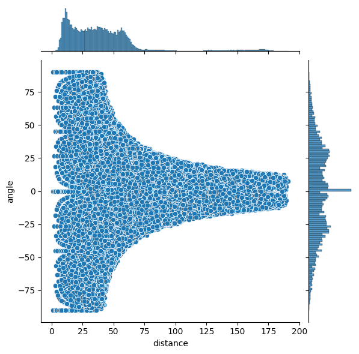
</figure>

Cette figure représente un histogramme 2D avec l'axe x (la distance) et l'axe y (l'angle). Dans cet histogramme, aucune séparation des tirs n'a été appliquée (buts et non-buts confondus). Cet histogramme en 2D nous permet d'analyser deux caractéristiques en même temps (distance, angle) et leur influence sur le nombre de tirs sans distinction de type. L'histogramme nous indique le plus grand nombre de tirs se fait près du filet (courte distance) et plus ou moins face au filet (angle proche de 0°).

### 2.2 

<figure >
    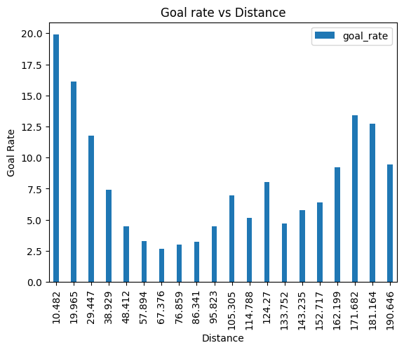
</figure>

Cette figure montre la relation entre le taux de buts et la distance. Le taux de buts est plus élevé pour les courtes distances. Une fois de plus, on remarque que se tenir près du filet augmente la probabilité de marquer un but. 

<figure>
    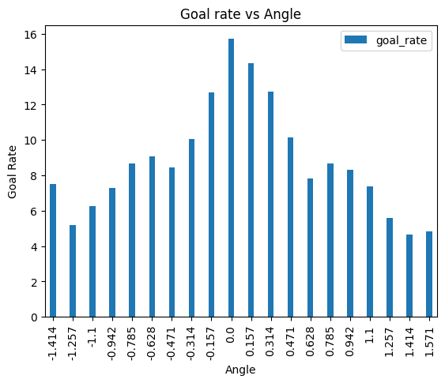
</figure>

Cette figure montre la relation entre le taux de buts et l'angle de tir. Le taux de buts est plus élevé pour les angles proches de 0, face au filet.

### 2.3 

<figure >
    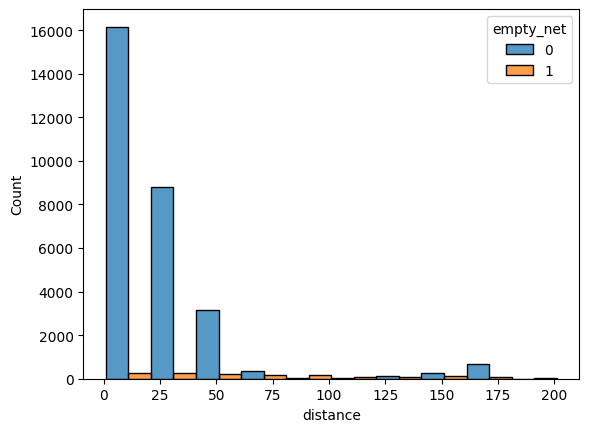
</figure>

Cette figure répresente un histogramme de buts classés par distance et montre la répartition des évènements nets vides et non-vides. La figure montre clairement qu'il y a beaucoup plus de buts avec filet non-vide lorsque la distance est courte. Il est donc plus compliqué de marquer un but avec filet non-vide (non-empty net) à une distance plus grande.  

La connaissance du domaine dit qu'« il est incroyablement rare de marquer un but net non vide sur l'équipe adverse depuis l'intérieur de votre zone défensive ».

On peut se baser sur notre observation précédente sur les nets vides et non vides pour rechercher des données qui pourraient être incorrectes. On pourrait vérifier si un but a été marqué avec un net non-vide à une distance très éloignée.

<h1> 3. Modèles de base </h1>

### 3.1 
 
Nous avons utilisé notre ensemble de données séparé en deux ensembles d'entrainement et de validation. Nous avons ensuite entrainé un classifieur de Logistic Regression en utilisant la caractéristique de distance avec les paramètres de défaut. Cela nous a permis d'obtenir la précision de notre modèle sur l'ensemble de validation.

La précision du modèle obtenu : 
*Accuracy*: 0.906208

On remarque que notre modèle donne toujours une prédiction de 0, et donc toujours un non-but. Un problème potentiel qui pourrait expliquer cette situation est le débalancement de notre ensemble de données. En effet, notre ensemble de données est constitué de 31095 buts (9.345%) et 301647 non-buts (90.655%). Le pourcentage de non-buts est tellement élevé par rapport à celui des buts que le modèle donne de fausses prédictions. 

### 3.2 et 3.3 

<figure >
    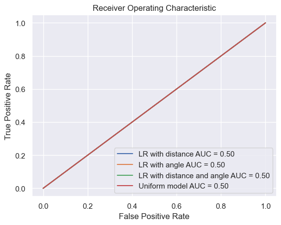
</figure>

Cette figure montre les courbes ROC pour les différents modèles. On remarque que tous les modèles ont la même valeur de AUC et qu'il n'y a pas de distinction avec le model uniforme. 

<figure>
    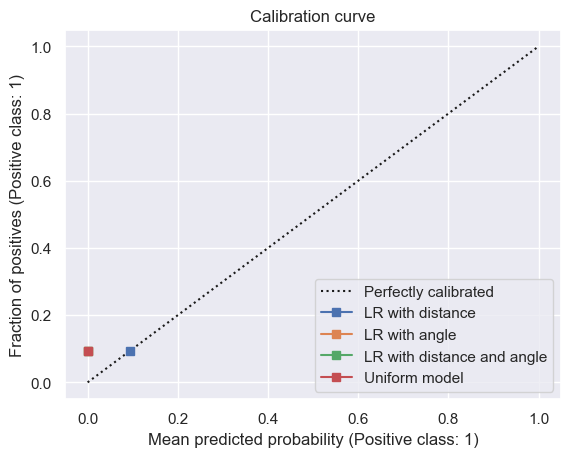
</figure>

Cette figure montre les courbes de calibration (calibration curve) pour les différents modèles. On constate que nos 03 modèles de Logistic Regression sont représentés en un et seul même point qui est placé très bas. Cette observation nous indique que la calibration n'est pas bonne.

<figure>
    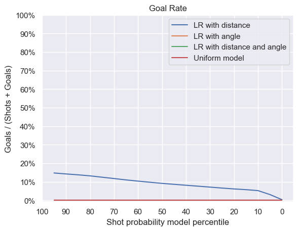
</figure>

Cette figure montre les courbes de taux de buts (goal rate) pour les différents modèles. Vu que notre modèle de Logistic Regression donne de fausses prédictions, on constate que le taux de buts diminue pour des valeurs faibles de 'shot probability model percentile'.

<figure>
    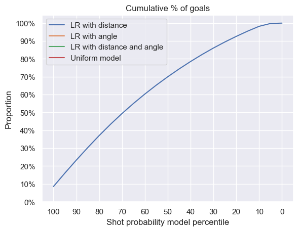
</figure>

Cette figure montre les courbes de proportion cumulée de buts pour les différents modèles. Comme le modèle prédit toujours des non-buts, on en déduit que la figure ne nous apporte pas d'informations correctes.

### 3.4
### 

Modèle: [question3-1-model](https://www.comet.com/princesslove/model-registry/question3-1-model)

Expérience: [question3.1](https://www.comet.com/princesslove/itf-6758-team-4/d29c9bc2c94c4051b212c645f2146bd4?experiment-tab=chart&showOutliers=true&smoothing=0&transformY=smoothing&xAxis=wall)

<table>
 <tr>
    <th>Métrique</th>
    <th>Valeur</th>
  </tr>
  <tr>
    <td>Accuracy</td>
    <td>0.906</td>  
  </tr>
  <tr>
    <td>AUC</td>
    <td>0.5</td>   
  </tr>  
  <tr>
    <td>f_score</td>
    <td>0.475</td>   
  </tr>  
  <tr>
    <td>Precision</td>
    <td>0.453</td>   
  </tr>  
  <tr>
    <td>Recall</td>
    <td>0.5</td>   
  </tr>  
</table>

<table>
  <tr>
    <td></td>
    <td>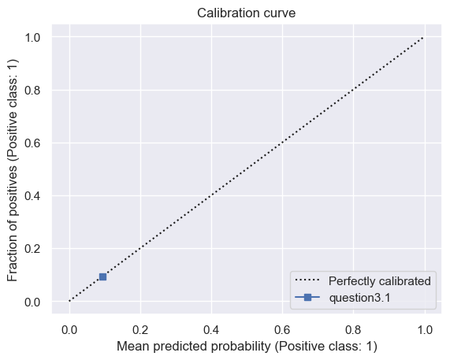</td>  
  </tr>
  <tr>
    <td>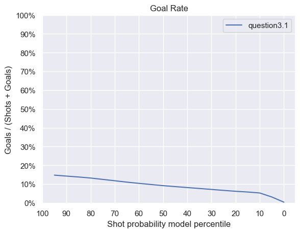</td>
    <td>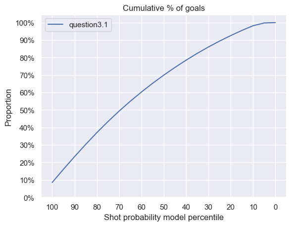</td>   
  </tr>  
</table>

Modèle: [question3-2-model](https://www.comet.com/princesslove/model-registry/question3-2-model)

Expérience: [question3.2](https://www.comet.com/princesslove/itf-6758-team-4/16bdcf3ef5bc47a4bcb298b02bf8cac0?experiment-tab=chart&showOutliers=true&smoothing=0&transformY=smoothing&xAxis=wall)

<table>
 <tr>
    <th>Métrique</th>
    <th>Valeur</th>
  </tr>
  <tr>
    <td>Accuracy</td>
    <td>0.906</td>  
  </tr>
  <tr>
    <td>AUC</td>
    <td>0.5</td>   
  </tr>  
  <tr>
    <td>f_score</td>
    <td>0.475</td>   
  </tr>  
  <tr>
    <td>Precision</td>
    <td>0.453</td>   
  </tr>  
  <tr>
    <td>Recall</td>
    <td>0.5</td>   
  </tr>  
</table>

<table>
  <tr>
    <td></td>
    <td>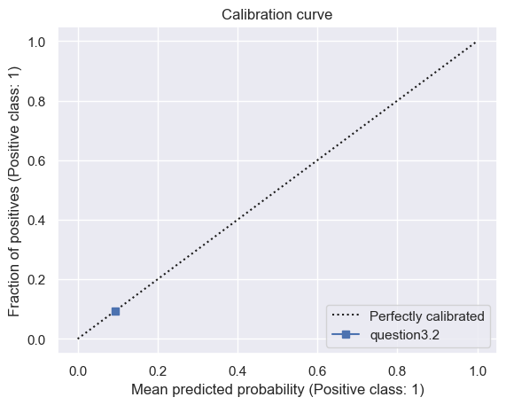</td>  
  </tr>
  <tr>
    <td>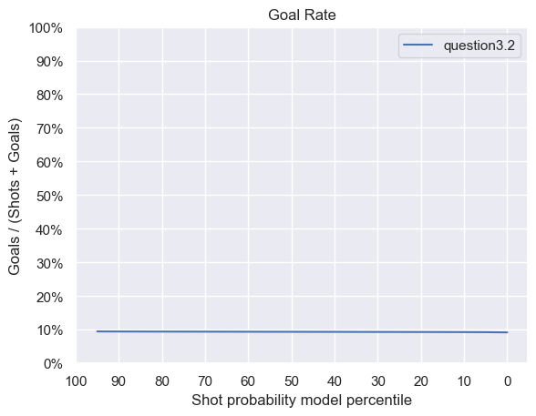</td>
    <td>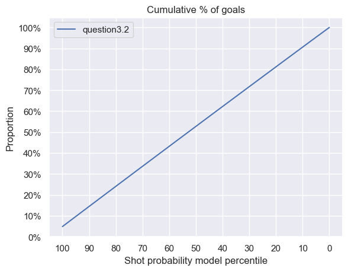</td>   
  </tr>  
</table>

Modèle: [question3-3-model](https://www.comet.com/princesslove/model-registry/question3-3-model)

Expérience: [question3.3](https://www.comet.com/princesslove/itf-6758-team-4/39b4bad6f6cc457f9fb1abcb5d26cf8e?experiment-tab=chart&showOutliers=true&smoothing=0&transformY=smoothing&xAxis=wall)

<table>
 <tr>
    <th>Métrique</th>
    <th>Valeur</th>
  </tr>
  <tr>
    <td>Accuracy</td>
    <td>0.906</td>  
  </tr>
  <tr>
    <td>AUC</td>
    <td>0.5</td>   
  </tr>  
  <tr>
    <td>f_score</td>
    <td>0.475</td>   
  </tr>  
  <tr>
    <td>Precision</td>
    <td>0.453</td>   
  </tr>  
  <tr>
    <td>Recall</td>
    <td>0.5</td>   
  </tr>  
</table>

<table>
  <tr>
    <td>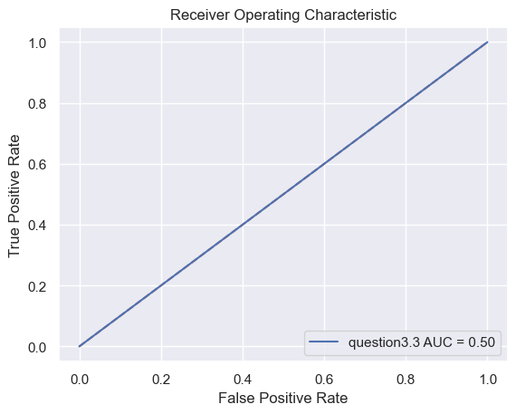</td>
    <td></td>  
  </tr>
  <tr>
    <td>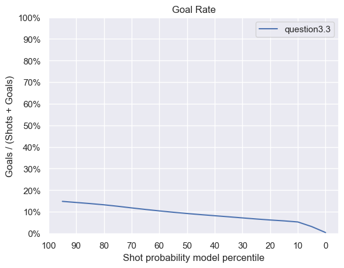</td>
    <td></td>   
  </tr>  
</table>
